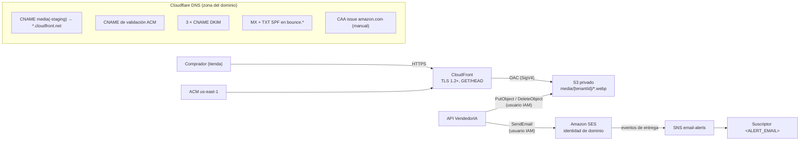
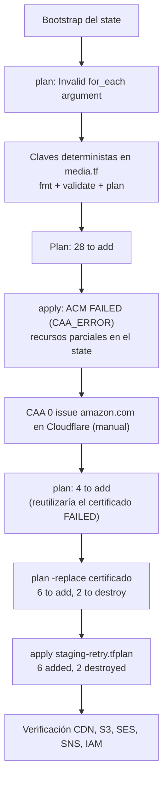

# Infraestructura de AWS con Terraform

Guía de despliegue y operación de la infraestructura AWS de VendedorIA: fotos de productos (S3 privado + CloudFront), correo transaccional (SES) y el usuario IAM de la API, con sus registros DNS en Cloudflare. Todo se declara en `infra/terraform/`.

Está escrita para que alguien que no participó en el primer despliegue pueda levantar **staging** o **producción** desde cero con PowerShell en Windows, y diagnosticar los problemas que ya aparecieron (sección 17 y anexo A).

Todo es opcional para la app: sin estas variables la API guarda las fotos en el volumen `uploads` y no envía correos (`EMAIL_MODE=preview`).

**Contenido**

1. [Arquitectura](#1-arquitectura)
2. [Qué crea Terraform y qué queda manual](#2-qué-crea-terraform-y-qué-queda-manual)
3. [Prerrequisitos](#3-prerrequisitos)
4. [Credenciales de la sesión: AWS SSO y Cloudflare](#4-credenciales-de-la-sesión-aws-sso-y-cloudflare)
5. [PowerShell: pasa los flags de Terraform entre comillas](#5-powershell-pasa-los-flags-de-terraform-entre-comillas)
6. [Bootstrap del remote state](#6-bootstrap-del-remote-state)
7. [Configuración por entorno](#7-configuración-por-entorno)
8. [Validaciones DNS previas (incluye CAA)](#8-validaciones-dns-previas-incluye-caa)
9. [Plan y apply](#9-plan-y-apply)
10. [Pasos manuales después del apply](#10-pasos-manuales-después-del-apply)
11. [Configuración del backend de VendedorIA](#11-configuración-del-backend-de-vendedoria)
12. [Verificación end-to-end](#12-verificación-end-to-end)
13. [Limpieza de los objetos de prueba](#13-limpieza-de-los-objetos-de-prueba)
14. [Seguridad](#14-seguridad)
15. [Staging vs producción](#15-staging-vs-producción)
16. [Operación y mantenimiento](#16-operación-y-mantenimiento)
17. [Troubleshooting](#17-troubleshooting)
18. [Importar recursos que ya existen](#18-importar-recursos-que-ya-existen)
19. [Checklist de despliegue](#19-checklist-de-despliegue)
20. [Anexo A: registro del primer despliegue de staging](#anexo-a-registro-del-primer-despliegue-de-staging)

---

## 1. Arquitectura



Flujo de las fotos:

```text
                    ┌──────────────┐
                    │  Cloudflare  │   CNAME explícito, "Solo DNS" (sin proxy)
                    │     DNS      │
                    └──────┬───────┘
                           │  media.<dominio> / media-staging.<dominio>
                           ▼
                    ┌──────────────┐
                    │  CloudFront  │   certificado ACM (us-east-1), redirect-to-https
                    └──────┬───────┘
                           │ Origin Access Control (firma SigV4)
                           ▼
                    ┌──────────────┐
                    │  S3 privado  │   Block Public Access, sin ACL, SSE-S3, versionado
                    └──────────────┘
```

Flujo del correo:

```text
API VendedorIA
       │  SESv2 SendEmail (configuration set <app>-<env>-transactional)
       ▼
Amazon SES  ── identidad de dominio <email_domain>
       ├── DKIM (Easy DKIM RSA 2048, 3 CNAME en Cloudflare)
       ├── MAIL FROM bounce.<email_domain> (MX + SPF)
       └── eventos BOUNCE, COMPLAINT, REJECT, RENDERING_FAILURE, DELIVERY_DELAY
                 │
                 ▼
                SNS  <app>-<env>-email-alerts
                 │
                 ▼
          suscripción email <ALERT_EMAIL> (requiere confirmación)
```

### Archivos

| Archivo | Contenido |
|---|---|
| `bootstrap/main.tf` | Bucket S3 del state de Terraform. Se aplica una vez por cuenta AWS, con state **local**. |
| `versions.tf` | Terraform `>= 1.10`, providers `hashicorp/aws ~> 6.0` y `cloudflare/cloudflare ~> 5.0`, backend S3 parcial, `locals` (`name`, `ses_region`, tags) y tres providers AWS: región principal, `us_east_1` (ACM para CloudFront) y `ses`. |
| `variables.tf` | Entradas. Se rellenan en `envs/<entorno>.tfvars`. |
| `media.tf` | Bucket de fotos, lifecycle, bucket policy, OAC, certificado ACM y su validación, distribución CloudFront, CNAME del CDN. |
| `ses.tf` | Configuration set, identidad SES, DKIM, MAIL FROM, SPF, DMARC opcional, supresión de cuenta, SNS, destino de eventos, alarmas de reputación. |
| `iam.tf` | Usuario IAM de la API y su política. |
| `outputs.tf` | `server_env`, `cloudfront_distribution_id`, `media_cdn_url`, `api_iam_user`, `email_alerts_topic_arn`. |
| `envs/*.tfvars.example` | Plantillas por entorno. Los `envs/*.tfvars` reales están en `.gitignore`. |
| `backend.hcl.example` | Plantilla del backend. `backend.hcl` real está en `.gitignore`. |
| `.terraform.lock.hcl` | Versiones exactas de los providers. **Sí** va en git. |

### Cómo se derivan los nombres

Ningún nombre está fijo por entorno: se calculan con `app_name` (por defecto `vendedoria`), `environment` (`staging` o `prod`) y el id de la cuenta que ejecuta Terraform (`data.aws_caller_identity`). `local.name` = `<app_name>-<environment>`.

| Recurso | Patrón | Staging (ejemplo) |
|---|---|---|
| Bucket del state (bootstrap) | `<app_name>-tfstate-<AWS_ACCOUNT_ID>` | `vendedoria-tfstate-<AWS_ACCOUNT_ID>` |
| Bucket de fotos | `<app_name>-media-<environment>-<AWS_ACCOUNT_ID>` | `vendedoria-media-staging-<AWS_ACCOUNT_ID>` |
| OAC | `<name>-media` | `vendedoria-staging-media` |
| Configuration set SES | `<name>-transactional` | `vendedoria-staging-transactional` |
| Tópico SNS | `<name>-email-alerts` | `vendedoria-staging-email-alerts` |
| Usuario y política IAM | `<name>-api` | `vendedoria-staging-api` |
| Alarmas (solo con `manage_account_settings`) | `<name>-ses-bounce-rate`, `<name>-ses-complaint-rate` | no se crean en staging |
| MAIL FROM | `<mail_from_subdomain>.<email_domain>` | `bounce.staging.marrso.com` |
| URL del CDN | `https://<media_domain>` o, si es `null`, `https://<id>.cloudfront.net` | `https://media-staging.marrso.com` |
| State remoto | `env:/<workspace>/aws.tfstate` en el bucket del state | `env:/staging/aws.tfstate` |

Todos los recursos AWS llevan las etiquetas `app`, `environment` y `managed-by = terraform`.

## 2. Qué crea Terraform y qué queda manual

Con `media_domain` definido, `alerts_email` definido, `manage_dmarc = false` y `manage_account_settings = false` (staging), el stack principal administra **28 recursos**:

| Grupo | Recursos |
|---|---|
| S3 (7) | `aws_s3_bucket.media`, `_public_access_block`, `_ownership_controls`, `_server_side_encryption_configuration`, `_versioning`, `_lifecycle_configuration`, `_policy` |
| CloudFront + ACM (4) | `aws_cloudfront_origin_access_control.media`, `aws_acm_certificate.media[0]`, `aws_acm_certificate_validation.media[0]`, `aws_cloudfront_distribution.media` |
| SES (4) | `aws_sesv2_configuration_set.transactional`, `aws_sesv2_email_identity.domain`, `aws_sesv2_email_identity_mail_from_attributes.domain`, `aws_sesv2_configuration_set_event_destination.alerts` |
| SNS (3) | `aws_sns_topic.email_alerts`, `aws_sns_topic_policy.email_alerts`, `aws_sns_topic_subscription.email_alerts[0]` |
| IAM (3) | `aws_iam_user.api`, `aws_iam_policy.api`, `aws_iam_user_policy_attachment.api` |
| Cloudflare (7) | `cloudflare_dns_record.media_certificate_validation["<media_domain>"]`, `cloudflare_dns_record.media[0]`, `cloudflare_dns_record.dkim[0..2]`, `cloudflare_dns_record.mail_from_mx`, `cloudflare_dns_record.mail_from_spf` |

En producción con `manage_account_settings = true` se suman `aws_sesv2_account_suppression_attributes.account[0]` y las dos alarmas de CloudWatch (31). Con `manage_dmarc = true` se sumaría `cloudflare_dns_record.dmarc[0]`.

**Queda manual, a propósito:**

| Paso | Por qué no lo hace Terraform |
|---|---|
| Registro CAA `0 issue "amazon.com"` en el dominio raíz | Es un registro de toda la zona, compartido por staging y prod. Hoy no está en el código (sección 8.3). |
| Access key del usuario IAM de la API | Si la creara Terraform, el secreto quedaría guardado en el state. |
| Confirmar la suscripción SNS por email | AWS exige que el destinatario pulse *Confirm subscription*. |
| Acceso de producción de SES (salir del sandbox) | Lo aprueba una persona de AWS. En la cuenta actual ya está concedido en `us-east-1` (sección 10.2). |
| Cargar las variables en el `.env` del servidor y `EMAIL_MODE=live` | Son secretos y decisiones de despliegue de la app, no infraestructura. |

## 3. Prerrequisitos

### 3.1 PowerShell

Los comandos están escritos para PowerShell en Windows (5.1 o 7+). Comprueba la versión:

```powershell
$PSVersionTable.PSVersion
```

Usa siempre `curl.exe` (no `curl`, que en Windows PowerShell 5.1 es un alias de `Invoke-WebRequest`).

### 3.2 Terraform 1.10 o superior, 64 bits

El backend usa el bloqueo nativo de S3 (`use_lockfile`), que exige Terraform 1.10+. El provider de Cloudflare no publica binarios de 32 bits.

```powershell
winget install Hashicorp.Terraform
terraform version        # debe decir "on windows_amd64" y una versión >= 1.10
```

Si dice `windows_386`, desinstala esa versión o reemplaza el `terraform.exe` que aparece en `where.exe terraform` por el binario *Windows AMD64* de developer.hashicorp.com/terraform/install.

### 3.3 AWS CLI v2

```powershell
winget install Amazon.AWSCLI
aws --version            # aws-cli/2.x
```

### 3.4 Cuenta AWS con IAM Identity Center (SSO)

- Una cuenta AWS con IAM Identity Center habilitado.
- Un usuario de Identity Center con un *permission set* que permita administrar S3, CloudFront, ACM, SES, SNS, CloudWatch e IAM (por ejemplo `AdministratorAccess` para el operador de infraestructura).
- El *start URL* del portal (`https://<SSO_START_URL>.awsapps.com/start`) y la región de Identity Center.

Las personas **nunca** usan access keys administrativas fijas ni la cuenta raíz: las credenciales de Terraform son temporales y salen de SSO.

### 3.5 Perfil `ops` de AWS CLI

Una sola vez por PC:

```powershell
aws configure sso --profile ops
# SSO session name:        vendedoria
# SSO start URL:           https://<SSO_START_URL>.awsapps.com/start
# SSO region:              <REGION_DE_IDENTITY_CENTER>
# SSO registration scopes: sso:account:access
# (se abre el navegador; eliges la cuenta <AWS_ACCOUNT_ID> y el permission set)
# CLI default client Region: us-east-1
# CLI default output format: json
```

Queda guardado en `%USERPROFILE%\.aws\config` (no contiene secretos de larga duración).

### 3.6 Cloudflare

- El dominio (en este proyecto, `marrso.com`) debe estar como zona activa en Cloudflare, con sus nameservers apuntando a Cloudflare.
- Necesitas su **Zone ID**: panel de Cloudflare → el dominio → *Overview* → columna derecha → *Zone ID*. En la documentación y los ejemplos se escribe `<CLOUDFLARE_ZONE_ID>`.
- Un API token con permisos mínimos (sección 4.3).

## 4. Credenciales de la sesión: AWS SSO y Cloudflare

Al empezar cada sesión de trabajo:

### 4.1 Login de AWS SSO

```powershell
aws sso login --profile ops
aws sts get-caller-identity --profile ops
```

`get-caller-identity` debe devolver la cuenta `<AWS_ACCOUNT_ID>` y un ARN del tipo `arn:aws:sts::<AWS_ACCOUNT_ID>:assumed-role/AWSReservedSSO_<PermissionSet>_.../<usuario>`. Si devuelve otra cuenta, detente.

### 4.2 Perfil para Terraform

Terraform no recibe un `--profile`; lee la variable de entorno:

```powershell
$env:AWS_PROFILE = "ops"
```

La sesión SSO caduca (normalmente en horas). Si Terraform responde `No valid credential sources found` o `ExpiredToken`, repite `aws sso login --profile ops`.

### 4.3 Token de Cloudflare

El provider (`provider "cloudflare" {}` en `versions.tf`) no tiene credenciales en el código: lee `CLOUDFLARE_API_TOKEN` del entorno.

```powershell
$env:CLOUDFLARE_API_TOKEN = "<CLOUDFLARE_API_TOKEN>"
```

Terraform solo administra recursos `cloudflare_dns_record` en una zona, así que el permiso mínimo es:

| Permiso | Alcance |
|---|---|
| **Zone → DNS → Edit** | *Include → Specific zone →* el dominio |

Créalo en Cloudflare → *My Profile* → *API Tokens* → *Create Token* → plantilla *Edit zone DNS* → *Zone Resources: Include · Specific zone · <dominio>*. Opcionalmente, restringe por IP y pon fecha de caducidad.

El token y el perfil viven solo en la terminal. Nunca los pongas en `.tfvars`, `backend.hcl`, scripts del repo ni en el historial compartido. Al cerrar la terminal desaparecen; para borrarlos antes:

```powershell
Remove-Item Env:CLOUDFLARE_API_TOKEN
```

## 5. PowerShell: pasa los flags de Terraform entre comillas

PowerShell puede partir un argumento que empieza por `-` y contiene un punto: `-backend-config=.\backend.hcl` o `-var-file=envs/staging.tfvars` llegan a Terraform como dos argumentos, y Terraform los toma como posicionales (`Too many command line arguments` o un error parecido). Los corchetes y comillas de `-replace=aws_acm_certificate.media[0]` tienen el mismo problema.

En el despliegue de staging funcionó siempre esta forma, que se usa en toda la guía:

```powershell
terraform init "-backend-config=.\backend.hcl"
terraform plan "-var-file=envs/staging.tfvars" "-out=staging.tfplan"
terraform plan "-replace=aws_acm_certificate.media[0]" "-var-file=envs/staging.tfvars" "-out=staging-retry.tfplan"
```

Los comandos multilínea usan el acento grave (`` ` ``) al final de la línea, sin espacios detrás.

## 6. Bootstrap del remote state

### 6.1 Por qué existe `bootstrap/`

El state es el registro de lo que Terraform creó. El stack principal lo guarda en S3 (backend `s3` en `versions.tf`), pero el bucket del state no puede crearse con un stack que necesita ese bucket para arrancar. Por eso `infra/terraform/bootstrap` es un stack aparte, con **state local**, que solo crea el bucket del state. Se aplica **una vez por cuenta AWS**, no por entorno.

`bootstrap/main.tf` crea `<app_name>-tfstate-<AWS_ACCOUNT_ID>` con:

| Control | Implementación |
|---|---|
| Cifrado | SSE-S3 `AES256` con bucket key |
| Versionado | `Enabled` (permite restaurar un state dañado) |
| Bloqueo de acceso público | los cuatro ajustes en `true` |
| Sin ACL | `BucketOwnerEnforced` |
| Solo TLS | política que deniega `s3:*` con `aws:SecureTransport = false` |
| Lifecycle | borra versiones antiguas del state a los 90 días |
| Protección | `prevent_destroy = true` |
| Bloqueo de concurrencia | no es un recurso: lo da el backend con `use_lockfile = true` (archivo `.tflock` junto al state, Terraform 1.10+). No hay tabla DynamoDB. |

### 6.2 Ejecutarlo (solo si el bucket no existe)

Comprueba primero si ya existe (en la cuenta actual ya existe; no lo vuelvas a crear):

```powershell
$account = aws sts get-caller-identity --profile ops --query Account --output text
aws s3api head-bucket --bucket "vendedoria-tfstate-$account" --profile ops
```

Si responde `404`/`Not Found`:

```powershell
cd infra\terraform\bootstrap
terraform init
terraform plan "-var=aws_region=us-east-1" "-out=bootstrap.tfplan"
terraform apply "bootstrap.tfplan"
terraform output -raw backend_config | Out-File -Encoding ascii ..\backend.hcl
```

`Out-File -Encoding ascii` importa: la redirección `>` de Windows PowerShell 5.1 escribe UTF-16 y Terraform no puede leer ese `backend.hcl`.

El state del bootstrap queda en `bootstrap/terraform.tfstate` (git-ignored) **solo en esa PC**. Guárdalo en un lugar privado; si se pierde no pasa nada grave: se recupera con `terraform import aws_s3_bucket.state vendedoria-tfstate-<AWS_ACCOUNT_ID>` (y el resto de recursos del bootstrap del mismo modo).

### 6.3 `backend.hcl`

El output `backend_config` genera exactamente:

```hcl
bucket       = "vendedoria-tfstate-<AWS_ACCOUNT_ID>"
key          = "aws.tfstate"
region       = "us-east-1"
encrypt      = true
use_lockfile = true
```

Con workspaces, el backend S3 guarda cada entorno en `env:/<workspace>/aws.tfstate` (staging: `env:/staging/aws.tfstate`). `backend.hcl` no es secreto, pero está fuera de git; guárdalo en tu gestor de contraseñas o regenéralo con el último comando de 6.2.

### 6.4 Inicializar el stack principal

```powershell
cd infra\terraform
terraform init "-backend-config=.\backend.hcl"
```

Si cambias `backend.hcl` después, añade `-reconfigure`.

## 7. Configuración por entorno

### 7.1 Workspaces: uno por entorno (obligatorio)

Cada entorno es un *workspace* de Terraform con su propio state. El bucket de fotos tiene una `precondition` que detiene el plan si `terraform.workspace` no coincide con `environment`:

```text
Select the workspace of this environment first: terraform workspace select staging
```

```powershell
terraform workspace list
terraform workspace new staging       # solo la primera vez
terraform workspace select staging    # las siguientes
terraform workspace show
```

El workspace `default` existe pero no se usa.

### 7.2 Archivos de variables

| Archivo | En git | Uso |
|---|---|---|
| `envs/staging.tfvars.example` | sí | plantilla de staging |
| `envs/prod.tfvars.example` | sí | plantilla de producción |
| `envs/staging.tfvars` | no (`.gitignore`) | valores reales de staging |
| `envs/prod.tfvars` | no (`.gitignore`) | valores reales de producción (todavía no existe en este repo) |

```powershell
Copy-Item envs\staging.tfvars.example envs\staging.tfvars
notepad envs\staging.tfvars
```

Los `.tfvars` no contienen secretos (credenciales siempre por `AWS_PROFILE` y `CLOUDFLARE_API_TOKEN`), pero tampoco van en git: contienen el Zone ID y el correo de alertas.

### 7.3 Variables

| Variable | Obligatoria | Por defecto | Qué es |
|---|---|---|---|
| `environment` | sí | — | `staging` o `prod`. Debe coincidir con el workspace. |
| `aws_region` | sí | — | Región del bucket de fotos y `AWS_REGION` de la API. |
| `ses_region` | no | `null` (= `aws_region`) | Solo si SES va en otra región; genera `SES_REGION` en `server_env`. |
| `cloudflare_zone_id` | sí | — | Zona que contiene `media_domain` y `email_domain`. |
| `app_name` | no | `vendedoria` | Prefijo de nombres (3–20 caracteres `a-z0-9-`). No lo cambies en un entorno ya desplegado: renombra (reemplaza) los recursos. |
| `media_prefix` | no | `media` | Prefijo de objetos. Debe coincidir con el que escribe `MediaService` (`media`). |
| `media_domain` | no | `null` | Host propio del CDN. `null` = sin ACM ni CNAME, se usa `*.cloudfront.net`. |
| `price_class` | no | `PriceClass_All` | Incluye los edge de Sudamérica. |
| `web_acl_arn` | no | `null` | WAF opcional (ámbito CLOUDFRONT, us-east-1). |
| `noncurrent_version_days` | no | `30` | Días que se conservan versiones borradas o sobrescritas. |
| `email_domain` | sí | — | Dominio remitente verificado en SES. |
| `email_from` | sí | — | `EMAIL_FROM` de la API; debe usar `email_domain`. |
| `mail_from_subdomain` | no | `bounce` | Subdominio MAIL FROM de `email_domain`. |
| `manage_dmarc` | no | `false` | Crear `_dmarc.<email_domain>`. |
| `dmarc_policy` / `dmarc_report_email` | no | `none` / `null` | Solo con `manage_dmarc = true`. |
| `manage_account_settings` | no | **`true`** | Supresión de la cuenta y alarmas de reputación. Ponlo explícitamente en `false` en staging. |
| `alerts_email` | no | `null` | Suscriptor email del tópico SNS. `null` = sin suscripción. |

### 7.4 Staging

```hcl
environment        = "staging"
aws_region         = "us-east-1"
cloudflare_zone_id = "<CLOUDFLARE_ZONE_ID>"

media_domain = "media-staging.marrso.com"

email_domain            = "staging.marrso.com"
email_from              = "VendedorIA Staging <pedidos@staging.marrso.com>"
manage_dmarc            = false
manage_account_settings = false
alerts_email            = "<ALERT_EMAIL>"
```

Por qué así:

- **Subdominio de correo propio** (`staging.marrso.com`): staging y prod están en la misma cuenta y región; una identidad SES distinta evita que staging toque la reputación, DKIM o MAIL FROM de producción.
- **`manage_dmarc = false`**: `marrso.com` ya publica DMARC (`p=reject`). Para `staging.marrso.com`, los receptores aplican la política del dominio organizativo `marrso.com` si el subdominio no tiene `_dmarc` propio. Crear otro `_dmarc` desde Terraform podría chocar con lo existente; y dos registros DMARC en el mismo nombre invalidan ambos.
- **`manage_account_settings = false`**: la lista de supresión y las alarmas de reputación son de toda la cuenta y región. Solo un workspace por cuenta+región debe administrarlas (producción); si staging y prod las declararan a la vez, se pisarían.

### 7.5 Producción

Plantilla en `envs/prod.tfvars.example`. Valores esperados para este proyecto (verifícalos antes del primer plan):

```hcl
environment        = "prod"
aws_region         = "us-east-1"
cloudflare_zone_id = "<CLOUDFLARE_ZONE_ID>"

media_domain = "media.marrso.com"

email_domain = "marrso.com"
email_from   = "VendedorIA <pedidos@marrso.com>"
# false: marrso.com ya publica DMARC.
manage_dmarc            = false
manage_account_settings = true
alerts_email            = "<ALERT_EMAIL>"
```

## 8. Validaciones DNS previas (incluye CAA)

Antes del **primer** apply de un entorno revisa qué existe ya en DNS para los nombres que Terraform va a crear. Usa `-Server 1.1.1.1` para evitar la caché local.

### 8.1 Nombres a revisar

```powershell
# Staging (cambia los nombres para prod: media.marrso.com, bounce.marrso.com, marrso.com)
Resolve-DnsName media-staging.marrso.com -Server 1.1.1.1
Resolve-DnsName bounce.staging.marrso.com -Type MX -Server 1.1.1.1
Resolve-DnsName bounce.staging.marrso.com -Type TXT -Server 1.1.1.1
Resolve-DnsName _dmarc.marrso.com -Type TXT -Server 1.1.1.1
Resolve-DnsName _dmarc.staging.marrso.com -Type TXT -Server 1.1.1.1
```

Y en el panel de Cloudflare → *DNS* → *Records*, busca registros con **exactamente** esos nombres.

### 8.2 Comodín, registro explícito y registro administrado por Terraform

| Tipo | Qué es | Ejemplo |
|---|---|---|
| Comodín | `*.marrso.com` responde por cualquier nombre que **no** tenga registro propio. | `A * → IP del VPS` (las tiendas `{slug}.marrso.com`) |
| Registro explícito | Registro con nombre exacto. Tiene prioridad sobre el comodín para ese nombre. | `CNAME media-staging → dXXXX.cloudfront.net` |
| Administrado por Terraform | Registro explícito que existe en el state. Lleva el comentario `... (Terraform)` en Cloudflare. | todos los de la sección 2 |

En staging, antes del apply, `media-staging.marrso.com` resolvía a la IP del VPS: no había registro propio, respondía el comodín. Es normal y no bloquea nada. Terraform creó después el CNAME explícito hacia CloudFront, que prevalece sobre el comodín.

Lo que **sí** bloquea es un registro explícito con el mismo nombre creado a mano: Cloudflare rechaza el CNAME (`An identical record already exists` / `record already exists`). Bórralo si es basura o impórtalo (sección 18).

**Nunca** edites ni borres a mano en Cloudflare o AWS un recurso que ya administra Terraform: el siguiente plan lo revertirá o fallará, y el state dejará de reflejar la realidad.

### 8.3 CAA: autorizar a Amazon a emitir certificados

Un registro **CAA** (Certification Authority Authorization) dice qué autoridades certificadoras pueden emitir certificados para un dominio. Si el dominio tiene al menos un CAA y ninguno autoriza a Amazon, ACM no puede emitir y el certificado termina en `FAILED` con `CAA_ERROR`. La CA busca el CAA en el nombre exacto y, si no hay, sube por el árbol (`media-staging.marrso.com` → `marrso.com`): el CAA del dominio raíz aplica a todos los subdominios.

Consulta en Windows: en el equipo usado, `Resolve-DnsName -Type CAA` no reconocía el tipo `CAA` y `nslookup -type=257` tampoco estaba soportado. Funciona DNS-over-HTTPS de Cloudflare:

```powershell
(Invoke-RestMethod "https://cloudflare-dns.com/dns-query?name=marrso.com&type=CAA" -Headers @{Accept="application/dns-json"}).Answer
(Invoke-RestMethod "https://cloudflare-dns.com/dns-query?name=media-staging.marrso.com&type=CAA" -Headers @{Accept="application/dns-json"}).Answer
```

Si el campo `data` aparece en formato hexadecimal (`\# ...`), consulta el mismo nombre en `https://dns.google/resolve?name=<DOMINIO>&type=CAA`, que lo devuelve legible.

Cómo interpretarlo:

- Sin respuesta (`Answer` vacío) en todo el árbol: cualquier CA puede emitir; ACM funciona.
- Hay CAA y alguno contiene `issue "amazon.com"` (o `amazontrust.com`, `awstrust.com`, `amazonaws.com`): ACM funciona.
- Hay CAA y ninguno autoriza a Amazon: **añade** `0 issue "amazon.com"` antes del apply.

`marrso.com` tenía CAA para `comodoca.com`, `digicert.com`, `letsencrypt.org`, `pki.goog` y `ssl.com` (las CA que usa Cloudflare), pero no para Amazon. Se añadió en Cloudflare, sobre el dominio raíz:

| Tipo | Nombre | Flags | Tag | Valor |
|---|---|---|---|---|
| CAA | `marrso.com` (`@`) | `0` | `issue` (*Only allow specific hostnames*) | `amazon.com` |

No hizo falta borrar las demás CA: los registros CAA se suman, cada uno autoriza a una CA más.

`issue` vs `issuewild`:

- `issue` autoriza certificados para nombres concretos (`media-staging.marrso.com`). Si no hay `issuewild`, también rige para comodines.
- `issuewild` autoriza solo certificados comodín (`*.marrso.com`) y, si existe, prevalece sobre `issue` para ellos.

El certificado de `media-staging.marrso.com` (y el de `media.marrso.com` en prod) es de nombre concreto: necesita `issue`.

**Estado actual: el CAA `amazon.com` es manual.** No existe ningún recurso CAA en `infra/terraform/` ni en el state. Es un prerrequisito de cualquier entorno nuevo en una zona con CAA. Como está en el dominio raíz, ya cubre `media.marrso.com` para producción. Ver recomendación en la sección 16.8.

## 9. Plan y apply

Requisitos de la terminal: sección 4 hecha (`aws sso login`, `$env:AWS_PROFILE`, `$env:CLOUDFLARE_API_TOKEN`) y CAA revisado.

```powershell
cd infra\terraform
terraform init "-backend-config=.\backend.hcl"
terraform workspace select staging        # "terraform workspace new staging" la primera vez

terraform fmt -recursive
terraform validate
terraform plan "-var-file=envs/staging.tfvars" "-out=staging.tfplan"
```

Revisa el plan antes de aplicar:

- Última línea. Primer despliegue de staging: `Plan: 28 to add, 0 to change, 0 to destroy.`
- En un entorno ya desplegado, cualquier `destroy` o `must be replaced` sobre el bucket, la distribución, la identidad SES o el usuario IAM es motivo para detenerse y entender por qué.
- Los valores `(known after apply)` son normales (ARN, ids, tokens DKIM, registros de validación ACM).

Aplica **exactamente** el plan guardado:

```powershell
terraform apply "staging.tfplan"
```

Un plan guardado solo se aplica si el state no cambió desde que se generó; si caduca, Terraform lo rechaza y hay que volver a planificar. No uses `terraform apply` sin plan guardado en entornos compartidos.

El primer apply tarda 5–15 minutos: la validación DNS del certificado y el despliegue de CloudFront son lentos. Si falla a mitad, **no** ejecutes `terraform destroy`: lee la sección 17.5.

Los archivos `*.tfplan` están en `.gitignore`. Contienen la configuración completa (incluido el correo de alertas): bórralos cuando ya no sirvan.

## 10. Pasos manuales después del apply

### 10.1 Confirmar la suscripción SNS

AWS envía a `<ALERT_EMAIL>` un correo *AWS Notification - Subscription Confirmation*. Pulsa **Confirm subscription**. Hasta entonces la suscripción está en `PendingConfirmation` y no llega ningún evento ni alarma.

```powershell
$topic = terraform output -raw email_alerts_topic_arn
aws sns list-subscriptions-by-topic --topic-arn $topic --region us-east-1 --profile ops `
  --query "Subscriptions[].{Protocol:Protocol,Arn:SubscriptionArn}"
```

`Arn` debe ser un ARN completo; si dice `PendingConfirmation`, falta confirmar. El enlace caduca a los 3 días: si caduca, vuelve a enviarlo desde la consola de SNS (*Request confirmation*) o con `terraform apply` tras reemplazar la suscripción.

### 10.2 Acceso de producción de SES

El acceso de producción es por **cuenta y región**. Compruébalo:

```powershell
aws sesv2 get-account --region us-east-1 --profile ops `
  --query "{Production:ProductionAccessEnabled,Sending:SendingEnabled,Enforcement:EnforcementStatus,Quota:SendQuota,Suppression:SuppressionAttributes}"
```

En la cuenta actual (`us-east-1`) dio `ProductionAccessEnabled: true`, `SendingEnabled: true`, `EnforcementStatus: HEALTHY`, con una cuota observada de `Max24HourSend: 50000` y `MaxSendRate: 14`. No hizo falta solicitarlo, y producción en la misma cuenta y región ya lo tiene. Las cuotas cambian: consúltalas siempre con `get-account` en lugar de asumirlas.

Si `ProductionAccessEnabled` es `false` (cuenta o región nueva): consola de SES → *Account dashboard* → *Request production access*. Tipo *Transactional*. Caso de uso sugerido: “Confirmaciones de pedido y avisos de envío a compradores que hicieron una compra en tiendas de la plataforma. Sin marketing. Rebotes y quejas gestionados con la lista de supresión y alertas SNS.” En sandbox solo llegan correos a direcciones verificadas (200 al día).

### 10.3 Access key del usuario IAM de la API

```powershell
$apiUser = terraform output -raw api_iam_user
aws iam list-access-keys --user-name $apiUser --profile ops      # máximo 2 keys por usuario
aws iam create-access-key --user-name $apiUser --profile ops
```

AWS devuelve `AccessKeyId` y `SecretAccessKey`.

> **Advertencias**
> - `SecretAccessKey` solo se muestra **una vez**, en ese momento. Si se pierde, se crea otra key y se borra la anterior.
> - Cópiala directamente al sistema de secretos del entorno de ejecución (o al `.env` del servidor, que está en `.gitignore`).
> - Nunca en documentación, Git, `.tfvars`, `backend.hcl`, Terraform state, tickets ni chats.
> - Limpia la terminal cuando termines (`Clear-Host`) y no guardes la salida en archivos.

## 11. Configuración del backend de VendedorIA

### 11.1 Lo que da Terraform

```powershell
terraform output
terraform output -raw media_cdn_url
terraform output -raw api_iam_user
terraform output -raw server_env
terraform output -raw cloudfront_distribution_id
terraform output -raw email_alerts_topic_arn
```

`server_env` en staging:

```env
AWS_REGION=us-east-1
MEDIA_STORAGE=s3
MEDIA_S3_BUCKET=vendedoria-media-staging-<AWS_ACCOUNT_ID>
MEDIA_CDN_URL=https://media-staging.marrso.com
EMAIL_PROVIDER=ses
EMAIL_FROM=VendedorIA Staging <pedidos@staging.marrso.com>
SES_CONFIGURATION_SET=vendedoria-staging-transactional
```

Solo añade `SES_REGION=...` si `ses_region` difiere de `aws_region`. `AWS_ACCESS_KEY_ID` y `AWS_SECRET_ACCESS_KEY` **no** salen de Terraform: la key se crea a mano (10.3) precisamente para que el secreto nunca esté en el state.

### 11.2 Variables completas de la API

Validadas al arrancar por `apps/api/src/config/env.validation.ts`; si falta algo, la API no arranca y dice qué variable. En el servidor van en el `.env` de la raíz del repo, que `docker-compose.yml` carga con `env_file: .env`.

| Variable | Valor | Origen | Notas |
|---|---|---|---|
| `AWS_REGION` | `us-east-1` | `server_env` | Obligatoria con `MEDIA_STORAGE=s3`, o con `EMAIL_MODE=live` + SES sin `SES_REGION`. |
| `AWS_ACCESS_KEY_ID` | `<SECRET>` | 10.3 | La leen los SDK de AWS (cadena de credenciales por defecto). No pasa por la validación. |
| `AWS_SECRET_ACCESS_KEY` | `<SECRET>` | 10.3 | Ídem. |
| `MEDIA_STORAGE` | `s3` | `server_env` | `local` (por defecto) guarda en `UPLOADS_DIR`. |
| `MEDIA_S3_BUCKET` | nombre del bucket | `server_env` | Obligatoria con `s3`. |
| `MEDIA_CDN_URL` | `https://media-staging.marrso.com` | `server_env` | Obligatoria con `s3`. Debe ser `https`, sin ruta y **no** un host `amazonaws.com`. |
| `UPLOADS_DIR` | `/app/apps/api/uploads` | ya existente | Se mantiene: las fotos anteriores a S3 se siguen sirviendo desde el volumen `uploads`. No lo borres. |
| `EMAIL_MODE` | `live` | **manual** | **No está en `server_env`.** Con `preview` (por defecto) los pedidos registran el correo pero no se envía nada. |
| `EMAIL_PROVIDER` | `ses` | `server_env` | `ses` (por defecto) o `resend`. |
| `EMAIL_FROM` | `VendedorIA Staging <pedidos@staging.marrso.com>` | `server_env` | Obligatoria con `live`. Debe ser del dominio verificado; la política IAM solo permite `*@<email_domain>`. |
| `SES_REGION` | — | `server_env` solo si difiere | Opcional. |
| `SES_CONFIGURATION_SET` | `vendedoria-staging-transactional` | `server_env` | Opcional para la validación; la identidad ya lo tiene como configuration set por defecto. Mantenlo igualmente. |

Bloque final de staging:

```env
AWS_REGION=us-east-1
AWS_ACCESS_KEY_ID=<SECRET>
AWS_SECRET_ACCESS_KEY=<SECRET>

MEDIA_STORAGE=s3
MEDIA_S3_BUCKET=vendedoria-media-staging-<AWS_ACCOUNT_ID>
MEDIA_CDN_URL=https://media-staging.marrso.com
UPLOADS_DIR=/app/apps/api/uploads

EMAIL_MODE=live
EMAIL_PROVIDER=ses
EMAIL_FROM=VendedorIA Staging <pedidos@staging.marrso.com>
SES_CONFIGURATION_SET=vendedoria-staging-transactional
```

Aplica los cambios recreando la API: `bash scripts/deploy.sh` o `docker compose up -d --force-recreate api` (ver [DEPLOY.md](DEPLOY.md)).

Rollback de la app sin tocar infraestructura: `MEDIA_STORAGE=local` y/o `EMAIL_MODE=preview` y recrear la API. Las fotos ya subidas a S3 siguen funcionando por CloudFront.

## 12. Verificación end-to-end

Todos los comandos son de solo lectura salvo la subida del objeto de prueba (12.4) y el correo de prueba (12.10). Ejecútalos desde `infra\terraform` con el workspace correcto seleccionado.

Variables auxiliares:

```powershell
$cdn    = terraform output -raw media_cdn_url
$distId = terraform output -raw cloudfront_distribution_id
$bucket = (terraform output -raw server_env | Where-Object { $_ -like 'MEDIA_S3_BUCKET=*' }) -replace '^MEDIA_S3_BUCKET=', ''
$cdnHost = ([uri]$cdn).Host
```

### 12.1 Certificado ACM

```powershell
aws acm list-certificates --region us-east-1 --profile ops `
  --query "CertificateSummaryList[?DomainName=='$cdnHost'].{Arn:CertificateArn,Status:Status}"
```

Debe haber uno en `ISSUED`. Un `FAILED` no se recupera solo (sección 17.4).

### 12.2 Distribución CloudFront

```powershell
aws cloudfront get-distribution --id $distId --profile ops `
  --query "Distribution.{Status:Status,Domain:DomainName,Aliases:DistributionConfig.Aliases.Items,Tls:DistributionConfig.ViewerCertificate.MinimumProtocolVersion}"
```

Esperado: `Status: Deployed`, alias = `media_domain`, `Tls: TLSv1.2_2021`.

### 12.3 DNS del CDN

```powershell
Resolve-DnsName $cdnHost -Type CNAME -Server 1.1.1.1
```

Esperado: `media-staging.marrso.com` → `dXXXXXXXXXXXXX.cloudfront.net` (el mismo `Domain` de 12.2). Si responde un registro `A` con la IP del VPS, el CNAME no existe y está respondiendo el comodín.

```powershell
curl.exe -I $cdn
```

Un `403 Forbidden` con `X-Cache: Error from cloudfront` en `/` es **correcto**: no hay objeto raíz ni *default root object*, y la bucket policy solo permite leer `media/*`. Lo que demuestra que funciona es la prueba 12.4.

### 12.4 Prueba S3 → CloudFront

Usa el prefijo `media/_healthcheck/`: el lifecycle del bucket borra esos objetos al día siguiente. Crea el archivo fuera del repo:

```powershell
$testFile = Join-Path $env:TEMP "cdn-test.txt"
"VendedorIA CDN OK - $(Get-Date)" | Set-Content $testFile

aws s3 cp $testFile "s3://$bucket/media/_healthcheck/cdn-test.txt" --profile ops
aws s3api head-object --bucket $bucket --key media/_healthcheck/cdn-test.txt --profile ops

curl.exe -i "$cdn/media/_healthcheck/cdn-test.txt"
```

Esperado:

```text
HTTP/1.1 200 OK
x-amz-server-side-encryption: AES256
X-Cache: Miss from cloudfront          (Hit from cloudfront en la segunda petición)
Via: 1.1 xxxx.cloudfront.net (CloudFront)

VendedorIA CDN OK - ...
```

Esto valida la cadena completa:

```text
Cliente ──HTTPS──▶ media-staging.marrso.com ──▶ CloudFront ──OAC──▶ S3 privado ──▶ media/_healthcheck/cdn-test.txt
```

Nota: un objeto inexistente bajo `media/` también devuelve **403** (no 404), porque CloudFront no tiene `s3:ListBucket`. Si un objeto que acabas de subir da 403, revisa la clave exacta antes de sospechar de la infraestructura.

### 12.5 Privacidad de S3

```powershell
curl.exe -I "https://$bucket.s3.us-east-1.amazonaws.com/media/_healthcheck/cdn-test.txt"
```

Esperado: `HTTP/1.1 403 Forbidden`. Es correcto: el bucket tiene Block Public Access, la única lectura permitida es la del servicio CloudFront firmada con OAC y limitada por `AWS:SourceArn` a esta distribución. CloudFront es la única capa pública.

### 12.6 Identidad SES y DKIM

```powershell
aws sesv2 get-email-identity --email-identity staging.marrso.com --region us-east-1 --profile ops `
  --query "{Type:IdentityType,Verified:VerifiedForSendingStatus,DkimSigning:DkimAttributes.SigningEnabled,DkimStatus:DkimAttributes.Status,DkimKey:DkimAttributes.CurrentSigningKeyLength,MailFrom:MailFromAttributes,ConfigSet:ConfigurationSetName}"
```

Esperado: `Type: DOMAIN`, `Verified: true`, `DkimSigning: true`, `DkimStatus: SUCCESS`, `DkimKey: RSA_2048_BIT`, `MailFromDomainStatus: SUCCESS`, `ConfigSet: vendedoria-staging-transactional`.

Los tres tokens DKIM los genera SES al crear la identidad y Terraform los publica como CNAME `<token>._domainkey.<email_domain>` → `<token>.dkim.amazonses.com`. Son distintos en cada identidad: no se copian entre entornos ni se documentan como valores fijos.

### 12.7 MAIL FROM y SPF

```powershell
Resolve-DnsName bounce.staging.marrso.com -Type MX -Server 1.1.1.1
Resolve-DnsName bounce.staging.marrso.com -Type TXT -Server 1.1.1.1
```

Esperado:

```text
MX   10 feedback-smtp.us-east-1.amazonses.com
TXT  v=spf1 include:amazonses.com ~all
```

- **MX**: el dominio del sobre (`Return-Path`) es `bounce.<email_domain>`; los rebotes vuelven a SES por ese MX, que los procesa (supresión, eventos SNS).
- **TXT SPF**: autoriza a los servidores de SES a enviar como `bounce.<email_domain>`. Como ese dominio es subdominio del `From`, SPF queda **alineado** para DMARC.
- Si el MX falla, SES usa su MAIL FROM por defecto (`behavior_on_mx_failure = USE_DEFAULT_VALUE`): el correo sale, pero sin alineación SPF.

### 12.8 DMARC

```powershell
Resolve-DnsName _dmarc.marrso.com -Type TXT -Server 1.1.1.1
```

Debe haber **un solo** registro `v=DMARC1`. Con DKIM firmado por `staging.marrso.com` y MAIL FROM `bounce.staging.marrso.com`, el correo pasa DMARC por alineación de DKIM y de SPF.

### 12.9 Cuenta SES

Ver 10.2. Revisa `ProductionAccessEnabled`, `SendingEnabled` y `EnforcementStatus`.

### 12.10 Correo real de prueba

```powershell
aws sesv2 send-email `
  --from-email-address "VendedorIA Staging <pedidos@staging.marrso.com>" `
  --destination "ToAddresses=<EMAIL_DE_PRUEBA>" `
  --content "Simple={Subject={Data='VendedorIA SES Staging OK',Charset=UTF-8},Body={Text={Data='Prueba exitosa de Amazon SES para VendedorIA staging.',Charset=UTF-8}}}" `
  --configuration-set-name "vendedoria-staging-transactional" `
  --region us-east-1 `
  --profile ops
```

Una respuesta `{"MessageId": "..."}` solo significa que **SES aceptó** el mensaje. La entrega se confirma aparte: el correo debe llegar a la bandeja (revisa spam) y, en *Mostrar original*, indicar `dkim=pass`, `spf=pass` y `dmarc=pass`.

Esta prueba usa el perfil `ops`: valida SES y DNS, no la política IAM de la API. La política se valida con la prueba de la app (12.13).

### 12.11 Alertas SNS

Ver 10.1. Opcional: enviar a `bounce@simulator.amazonses.com` con el comando de 12.10 genera un evento `BOUNCE` que debe llegar a `<ALERT_EMAIL>` (el simulador no afecta la reputación).

### 12.12 Usuario IAM

```powershell
$apiUser = terraform output -raw api_iam_user
aws iam list-attached-user-policies --user-name $apiUser --profile ops
$policyArn = aws iam list-attached-user-policies --user-name $apiUser --profile ops --query "AttachedPolicies[0].PolicyArn" --output text
$version = aws iam get-policy --policy-arn $policyArn --profile ops --query "Policy.DefaultVersionId" --output text
aws iam get-policy-version --policy-arn $policyArn --version-id $version --profile ops --query "PolicyVersion.Document"
```

Debe coincidir con la sección 14.3.

### 12.13 Auditoría automática y prueba con la app

Script de solo lectura (bucket, OAC, distribución, SES, DKIM, MAIL FROM, DMARC, configuration set):

```powershell
cd ..\..                                       # raíz del repo
npm i --no-save @aws-sdk/client-cloudfront
Push-Location infra\terraform
terraform output -raw server_env | ForEach-Object { $k, $v = $_ -split '=', 2; Set-Item "env:$k" $v }
$env:CLOUDFRONT_DISTRIBUTION_ID = terraform output -raw cloudfront_distribution_id
Pop-Location
$env:AWS_PROFILE = "ops"
node .agents/skills/vendedoria-aws/scripts/check-aws.mjs --write-test
```

Corrige todo `FAIL`. `--write-test` escribe y borra un objeto en `media/_healthcheck/`.

Prueba con la app (valida también la access key y la política IAM): con el `.env` de la sección 11 cargado, sube una foto en la consola (la URL debe empezar por `MEDIA_CDN_URL`), ábrela en la tienda y haz un pedido de prueba pagado: el correo debe llegar con `dkim=pass`, `spf=pass` y `dmarc=pass`.

## 13. Limpieza de los objetos de prueba

Los objetos de prueba no son infraestructura declarativa: se borran con AWS CLI, nunca con cambios de Terraform.

Los objetos bajo `media/_healthcheck/` caducan solos al día siguiente. Para el objeto que se subió en el primer despliegue de staging (`media/cdn-test.txt`) o cualquier otro:

```powershell
aws s3 rm "s3://$bucket/media/cdn-test.txt" --profile ops
```

El bucket está versionado: `rm` deja un *delete marker* y la versión anterior pasa a no actual. Ambas desaparecen solas (versiones no actuales a los `noncurrent_version_days` días, 30 por defecto; luego el delete marker huérfano). Para borrarlo por completo al momento:

```powershell
aws s3api list-object-versions --bucket $bucket --prefix media/cdn-test.txt --profile ops `
  --query "{Versions:Versions[].VersionId,Markers:DeleteMarkers[].VersionId}"
aws s3api delete-object --bucket $bucket --key media/cdn-test.txt --version-id <VERSION_ID> --profile ops
```

CloudFront puede seguir sirviendo la copia en caché hasta que caduque (la política `CachingOptimized` usa 24 h por defecto para objetos sin `Cache-Control`). Si molesta, se puede invalidar esa ruta concreta:

```powershell
aws cloudfront create-invalidation --distribution-id $distId --paths "/media/cdn-test.txt" --profile ops
```

Borra también el archivo local: `Remove-Item $testFile`. Si quedó una copia en `infra\terraform\cdn-test.txt`, bórrala: no está en `.gitignore`.

## 14. Seguridad

### 14.1 Fotos: S3 + CloudFront

- **Bucket privado**: Block Public Access con los cuatro ajustes, `BucketOwnerEnforced` (ACL desactivadas), sin website endpoint.
- **OAC**: CloudFront firma cada petición al origen con SigV4 (`signing_behavior = always`). La bucket policy solo permite `s3:GetObject` sobre `media/*` al servicio `cloudfront.amazonaws.com` con `AWS:SourceArn` = esta distribución. Otra distribución, aunque sea de la misma cuenta, no puede leer.
- **Solo TLS hacia S3**: la bucket policy deniega `s3:*` sin `aws:SecureTransport`.
- **HTTPS para el público**: `redirect-to-https`, certificado ACM (us-east-1) con SNI, TLS mínimo `TLSv1.2_2021`, HTTP/2 y HTTP/3, solo `GET`/`HEAD`.
- **Cabeceras**: política gestionada `Managed-SecurityHeadersPolicy` (HSTS, `nosniff`, etc.).
- **Cifrado en reposo**: SSE-S3 `AES256` con bucket key.
- **Recuperación**: versionado + lifecycle (versiones no actuales 30 días). `prevent_destroy` impide borrar el bucket con Terraform.
- **DNS sin proxy**: el CNAME del CDN y el de validación ACM están en *Solo DNS*; CloudFront termina el TLS del alias.
- La API valida que `MEDIA_CDN_URL` no sea un endpoint `amazonaws.com`, para que nunca se sirva el bucket directamente.

### 14.2 State de Terraform

- Bucket propio, privado, cifrado, versionado, solo TLS, con `prevent_destroy`.
- `encrypt = true` en el backend y bloqueo con `use_lockfile`.
- El state contiene ids, dominios y el correo de alertas; **no** contiene access keys. Aun así, solo los operadores deben poder leerlo.
- Nunca subas `*.tfstate`, `*.tfplan`, `backend.hcl` ni `envs/*.tfvars` (ya están en `.gitignore`).

### 14.3 IAM de la aplicación (least privilege)

Política `<name>-api`, adjunta solo al usuario `<name>-api`:

| Sid | Acciones | Recurso | Condición |
|---|---|---|---|
| `ManageProductMedia` | `s3:PutObject`, `s3:DeleteObject` | `arn:aws:s3:::<bucket>/media/*` | — |
| `SendTransactionalEmail` | `ses:SendEmail` | la identidad `<email_domain>` y el configuration set `<name>-transactional` | `ses:FromAddress` `StringLike` `*@<email_domain>` |

La API **no** puede: listar el bucket, leer objetos por S3, tocar otros prefijos o buckets, enviar correo desde otro dominio o identidad, ni administrar nada.

Separación de credenciales:

```text
Personas / DevOps  →  AWS IAM Identity Center (SSO)  →  perfil "ops"  →  credenciales temporales
Backend VendedorIA →  usuario IAM <name>-api          →  access key propia, solo en el entorno de ejecución
```

Nunca uses credenciales del perfil `ops` en la app, ni la key de la app para operar.

### 14.4 Secretos

- `CLOUDFLARE_API_TOKEN`: solo variable de la terminal, con alcance *Zone → DNS → Edit* sobre una zona.
- Access keys de AWS: solo en el sistema de secretos o el `.env` del servidor (`.env` y `.env.*` están en `.gitignore`, salvo los `*.example`). Nunca en el repo, imágenes Docker, logs, `.tfvars` ni state.
- Rotación al menos cada 90 días y revocación inmediata ante sospecha (16.4).

### 14.5 Correo

- **DKIM**: Easy DKIM RSA 2048 sobre el dominio remitente.
- **SPF**: MAIL FROM propio `bounce.<email_domain>` con `v=spf1 include:amazonses.com ~all`.
- **DMARC**: `marrso.com` ya publica DMARC (`p=reject`); Terraform no lo toca (`manage_dmarc = false`).
- **TLS hacia el receptor**: el configuration set exige TLS (`tls_policy = REQUIRE`).
- **Supresión**: el configuration set suprime destinatarios por `BOUNCE` y `COMPLAINT`. A nivel de cuenta, la supresión la administra el workspace con `manage_account_settings = true` (prod).
- **Alertas**: `BOUNCE`, `COMPLAINT`, `REJECT`, `RENDERING_FAILURE` y `DELIVERY_DELAY` van al tópico SNS. Las alarmas de CloudWatch (rebote > 4 %, queja > 0,08 %, por debajo de los umbrales de revisión de SES del 5 % y 0,1 %) solo existen donde `manage_account_settings = true`.
- La política del tópico solo permite publicar a SES y CloudWatch de la misma cuenta (`AWS:SourceAccount`).
- La API todavía no consume los eventos SNS; la protección depende de la lista de supresión.

## 15. Staging vs producción

| Aspecto | Staging | Producción |
|---|---|---|
| Workspace | `staging` | `prod` |
| Archivo | `envs/staging.tfvars` | `envs/prod.tfvars` (crearlo desde `.example`) |
| `media_domain` | `media-staging.marrso.com` | `media.marrso.com` |
| `email_domain` | `staging.marrso.com` | `marrso.com` |
| MAIL FROM | `bounce.staging.marrso.com` | `bounce.marrso.com` |
| `email_from` | `VendedorIA Staging <pedidos@staging.marrso.com>` | `VendedorIA <pedidos@marrso.com>` |
| Bucket de fotos | `vendedoria-media-staging-<AWS_ACCOUNT_ID>` | `vendedoria-media-prod-<AWS_ACCOUNT_ID>` |
| Configuration set | `vendedoria-staging-transactional` | `vendedoria-prod-transactional` |
| Usuario IAM | `vendedoria-staging-api` | `vendedoria-prod-api` |
| Tópico SNS | `vendedoria-staging-email-alerts` | `vendedoria-prod-email-alerts` |
| `manage_account_settings` | `false` | `true` (supresión de cuenta + 2 alarmas) |
| `manage_dmarc` | `false` | `false` (DMARC existente en `marrso.com`) |
| `alerts_email` | `<ALERT_EMAIL>` | `<ALERT_EMAIL>` (buzón del equipo, no personal) |
| Recursos del primer plan | 28 | 31 (con `alerts_email` y `manage_dmarc = false`) |
| State | `env:/staging/aws.tfstate` | `env:/prod/aws.tfstate` |

Lo que **comparten** (misma cuenta y región): el bucket del state, `backend.hcl`, el acceso de producción de SES, la supresión a nivel de cuenta, la zona de Cloudflare y el CAA `amazon.com` del dominio raíz.

### 15.1 Procedimiento para producción

No reutilices nada de staging que dependa del entorno: ni el `.tfplan` (un plan va ligado a su workspace, state y variables), ni la access key, ni el `.env`.

```powershell
aws sso login --profile ops
aws sts get-caller-identity --profile ops
$env:AWS_PROFILE = "ops"
$env:CLOUDFLARE_API_TOKEN = "<CLOUDFLARE_API_TOKEN>"

cd infra\terraform
Copy-Item envs\prod.tfvars.example envs\prod.tfvars
notepad envs\prod.tfvars                       # valores de 7.5

terraform init "-backend-config=.\backend.hcl"
terraform workspace new prod                   # primera vez; luego: terraform workspace select prod
terraform workspace show                       # debe decir prod
```

Validaciones DNS previas (sección 8) para `media.marrso.com`, `bounce.marrso.com`, `_dmarc.marrso.com` y CAA de `marrso.com` / `media.marrso.com`. Comprueba también que `marrso.com` no exista ya como identidad SES creada a mano (`aws sesv2 get-email-identity --email-identity marrso.com`); si existe, impórtala (sección 18).

```powershell
terraform fmt -recursive
terraform validate
terraform plan "-var-file=envs/prod.tfvars" "-out=prod.tfplan"
```

Revisión obligatoria antes del apply, idealmente por una segunda persona:

- `Plan: 31 to add, 0 to change, 0 to destroy.` (o el número que justifique tu `prod.tfvars`).
- Ningún recurso con `staging` en el nombre; todos con `vendedoria-prod-...`.
- Dominios de prod en el certificado, el alias, la identidad y los registros DNS.
- Que no aparezca `cloudflare_dns_record.dmarc`.
- Que aparezcan `aws_sesv2_account_suppression_attributes.account[0]` y las dos alarmas.

```powershell
terraform apply "prod.tfplan"
```

Después: secciones 10 (suscripción SNS, access key `vendedoria-prod-api`), 11 (`.env` de producción con `EMAIL_MODE=live`), 12 (verificación con los nombres de prod) y 13.

## 16. Operación y mantenimiento

### 16.1 Comandos seguros

```powershell
terraform workspace show
terraform state list
terraform output
terraform plan "-var-file=envs/staging.tfvars"
```

Tras un despliegue estable, `plan` debe terminar en:

```text
No changes. Your infrastructure matches the configuration.
```

### 16.2 Drift

Cualquier cambio hecho a mano en AWS o Cloudflare sobre recursos administrados aparece en el siguiente `plan`. Para automatizarlo:

```powershell
terraform plan "-var-file=envs/staging.tfvars" -detailed-exitcode
$LASTEXITCODE        # 0 = sin cambios, 1 = error, 2 = hay diferencias
```

Ante diferencias: si el cambio manual era un error, `plan` + `apply` lo revierte; si era necesario, llévalo al código y vuelve a planificar.

### 16.3 Comprobaciones rápidas

| Qué | Comando |
|---|---|
| DNS del CDN | `Resolve-DnsName (([uri](terraform output -raw media_cdn_url)).Host) -Type CNAME -Server 1.1.1.1` |
| CloudFront | `aws cloudfront get-distribution --id (terraform output -raw cloudfront_distribution_id) --profile ops --query "Distribution.Status"` |
| Objeto por CDN | subir a `media/_healthcheck/` y `curl.exe -i` (sección 12.4) |
| SES cuenta | `aws sesv2 get-account --region us-east-1 --profile ops` |
| SES identidad | `aws sesv2 get-email-identity --email-identity <EMAIL_DOMAIN> --region us-east-1 --profile ops` |
| Suscripción SNS | sección 10.1 |
| Todo junto | script de auditoría (12.13) |

### 16.4 Rotar la access key de la API sin cortes

Un usuario IAM admite dos keys a la vez, lo que permite rotar sin downtime:

```powershell
$apiUser = terraform output -raw api_iam_user
aws iam list-access-keys --user-name $apiUser --profile ops      # debe haber 1 (si hay 2, borra antes la inactiva)
aws iam create-access-key --user-name $apiUser --profile ops     # nueva key: directo al sistema de secretos
```

1. Sustituye `AWS_ACCESS_KEY_ID` y `AWS_SECRET_ACCESS_KEY` en el entorno de ejecución y recrea la API (`docker compose up -d --force-recreate api`).
2. Verifica: subida de una foto y un correo de prueba desde la app.
3. Comprueba que la key vieja dejó de usarse:
   ```powershell
   aws iam get-access-key-last-used --access-key-id <OLD_ACCESS_KEY_ID> --profile ops
   ```
4. Desactívala (reversible) y espera un margen:
   ```powershell
   aws iam update-access-key --user-name $apiUser --access-key-id <OLD_ACCESS_KEY_ID> --status Inactive --profile ops
   ```
5. Bórrala:
   ```powershell
   aws iam delete-access-key --user-name $apiUser --access-key-id <OLD_ACCESS_KEY_ID> --profile ops
   ```

**Revocación de emergencia** (key filtrada): ejecuta primero el paso 4 sobre la key comprometida, aunque la app falle unos minutos; luego crea una nueva, despliega y bórrala. Revisa CloudTrail por uso indebido.

### 16.5 Actualizar Terraform y los providers

```powershell
terraform init -upgrade "-backend-config=.\backend.hcl"
terraform providers lock -platform=windows_amd64 -platform=linux_amd64 -platform=darwin_arm64 -platform=darwin_amd64
terraform plan "-var-file=envs/staging.tfvars"
```

Si el plan de staging sale limpio (o con cambios que entiendes), aplícalo, prueba, repite en prod y haz commit de `.terraform.lock.hcl`. Un salto de versión mayor (`~> 6.0` → `~> 7.0`) exige leer antes la guía de actualización del provider. Terraform CLI: `winget upgrade Hashicorp.Terraform`.

### 16.6 Otra PC u otra persona

```powershell
git clone <REPO_URL>
cd vendedoria\infra\terraform
# backend.hcl: regénéralo desde bootstrap (6.2) o cópialo del gestor de contraseñas
# envs/<entorno>.tfvars: del gestor de contraseñas (no está en git)
aws sso login --profile ops
$env:AWS_PROFILE = "ops"
$env:CLOUDFLARE_API_TOKEN = "<CLOUDFLARE_API_TOKEN>"
terraform init "-backend-config=.\backend.hcl"
terraform workspace select staging
terraform plan "-var-file=envs/staging.tfvars"
```

### 16.7 Rollback y recuperación

- **La app falla con S3 o SES**: `MEDIA_STORAGE=local` y/o `EMAIL_MODE=preview` en el `.env` y recrear la API.
- **Un cambio de infraestructura salió mal**: `git revert` del cambio → `plan` → `apply`.
- **Foto borrada por error**: consola de S3 → *Show versions* → restaura la versión (30 días).
- **State dañado**: restaura la versión anterior de `env:/<workspace>/aws.tfstate` en el bucket del state (versionado, 90 días).
- **`Error acquiring the state lock`**: hay otra ejecución en curso. Si estás seguro de que no (una terminal se cerró a medias): `terraform force-unlock <LOCK_ID>`.

### 16.8 Recomendación pendiente: CAA en Terraform

El CAA `0 issue "amazon.com"` es hoy un cambio manual en Cloudflare. Incorporarlo al código evitaría que alguien lo borre sin saber que ACM depende de él, pero:

- Es un registro de la zona, no de un entorno: no puede declararse igual en los workspaces `staging` y `prod` (ambos intentarían administrar el mismo registro).
- Opciones: declararlo solo en un workspace detrás de una variable (como `manage_account_settings`) e importarlo, o un stack pequeño compartido para la zona.
- Cuando la zona tiene CAA, Cloudflare añade por su cuenta registros para sus propias CA; Terraform no debe intentar administrarlos.

Es un cambio de infraestructura aparte: requiere `import` + `plan` revisado y no forma parte de esta guía.

## 17. Troubleshooting

| Síntoma | Causa | Solución |
|---|---|---|
| `Too many command line arguments` o flags tratados como posicionales | PowerShell partió `-flag=valor.ext` | Flags entre comillas: `terraform plan "-var-file=envs/staging.tfvars" "-out=staging.tfplan"` (sección 5) |
| `Invalid for_each argument` | Claves de `for_each` que dependen de valores desconocidos hasta el apply | Claves deterministas en plan (17.2) |
| `waiting for ACM Certificate ... unexpected state 'FAILED' ... CAA_ERROR` | El CAA del dominio no autoriza a Amazon | `0 issue "amazon.com"` (8.3) y reemplazar el certificado (17.4) |
| El certificado sigue `FAILED` tras corregir el DNS | ACM no reintenta certificados fallidos | `-replace` (17.4) |
| Apply falla a mitad | Terraform no hace rollback | `plan` para reconciliar, sin `destroy` (17.5) |
| `403` en `https://<cdn>/` | No hay objeto raíz y la policy solo permite `media/*` | Normal; prueba un objeto real bajo `media/` (12.4) |
| `403` en un objeto `media/...` por CDN | La clave no existe (sin `ListBucket`, S3 responde 403) o la distribución todavía no está `Deployed` | `aws s3api head-object` con la clave exacta; esperar `Deployed` |
| CloudFront `200` pero S3 directo `403` | Comportamiento esperado: bucket privado + OAC | Nada que corregir (12.5) |
| `media.<dominio>` resuelve a la IP del VPS | Responde el comodín: falta el CNAME | Revisar que `cloudflare_dns_record.media[0]` esté en el state y aplicado |
| SES no envía | Cuenta en sandbox, envío pausado, identidad sin verificar, `EMAIL_MODE` no es `live` | 17.6 |
| No llegan alertas SNS | Suscripción sin confirmar | 10.1 |
| `Select the workspace of this environment first` | Workspace distinto de `environment` | `terraform workspace select <entorno>` |
| `No valid credential sources found` / `ExpiredToken` | Sin `AWS_PROFILE` o sesión SSO caducada | `aws sso login --profile ops` y `$env:AWS_PROFILE = "ops"` |
| Error de autenticación de Cloudflare | Falta el token o no cubre la zona | Revisar `$env:CLOUDFLARE_API_TOKEN` y su alcance (4.3) |
| `does not have a package available for your current platform, windows_386` | Terraform de 32 bits | Instalar la versión de 64 bits (3.2) |
| `Backend initialization required` | Falta `init` o cambió `backend.hcl` | `terraform init "-backend-config=.\backend.hcl"` (`-reconfigure` si cambió) |
| `An identical record already exists` | Registro DNS creado a mano con el mismo nombre | Borrarlo si es basura o importarlo (18) |
| `CNAMEAlreadyExists` en CloudFront | `media_domain` ya es alias de otra distribución | Quitarlo de la otra o usar otro dominio |
| `already exists` en SES | Identidad creada a mano | Importarla (18) |
| `Instance cannot be destroyed` | `prevent_destroy` del bucket | Intencional |
| DMARC `FAIL` en la auditoría (“multiple records”) | Dos registros `_dmarc` | Dejar uno; con uno existente, `manage_dmarc = false` |
| `Error acquiring the state lock` | Otra ejecución en curso | Esperar o `terraform force-unlock <LOCK_ID>` (16.7) |

### 17.1 Flags interpretados como argumentos

Ver sección 5.

### 17.2 `Invalid for_each argument`

Terraform necesita conocer las **claves** de `for_each` durante el plan, porque cada clave es la dirección de una instancia en el state (`recurso["clave"]`). Los **valores** sí pueden ser `(known after apply)`.

En el primer intento, `media.tf` derivaba las claves de `aws_acm_certificate.media[0].domain_validation_options`, que no existe hasta que ACM crea el certificado. El código actual usa como clave el dominio de la variable (en minúsculas, igual que lo normaliza ACM) y deja como valores los datos de validación:

```hcl
resource "cloudflare_dns_record" "media_certificate_validation" {
  for_each = local.has_media_domain ? toset([lower(var.media_domain)]) : toset([])
  name = trimsuffix(one([
    for option in aws_acm_certificate.media[0].domain_validation_options : option.resource_record_name
    if option.domain_name == each.key
  ]), ".")
  # type y content se obtienen igual
}
```

No se resuelve con `-target`: deja applies parciales fuera del flujo normal de plan revisado y el problema vuelve en el siguiente entorno.

### 17.3 ACM `CAA_ERROR`

Diagnóstico:

```powershell
(Invoke-RestMethod "https://cloudflare-dns.com/dns-query?name=<DOMINIO>&type=CAA" -Headers @{Accept="application/dns-json"}).Answer
```

Revisa el nombre del certificado y cada padre hasta el dominio raíz. Solución: añadir `0 issue "amazon.com"` (sección 8.3), sin borrar las otras CA. Luego reemplaza el certificado (17.4).

### 17.4 Certificado ACM en `FAILED`

Corregir el DNS no revive un certificado fallido: ACM no lo reintenta. Y Terraform no ve el estado `FAILED` como un cambio, así que un `plan` normal propone reutilizarlo y el apply volvería a fallar esperando la validación. Hay que pedir uno nuevo:

```powershell
terraform plan `
  "-replace=aws_acm_certificate.media[0]" `
  "-var-file=envs/staging.tfvars" `
  "-out=staging-retry.tfplan"
```

Revisa que los `destroy` sean solo el certificado fallido y su CNAME de validación. El certificado tiene `create_before_destroy`, así que el nuevo se crea antes de borrar el viejo. Después:

```powershell
terraform apply "staging-retry.tfplan"
```

### 17.5 Apply fallido a mitad

`terraform apply` no es transaccional: lo que se creó bien sigue existiendo en AWS/Cloudflare y queda registrado en el state remoto. Un recurso que falló a mitad de creación puede quedar marcado como *tainted* y se reemplaza en el siguiente apply.

1. **No** ejecutes `terraform destroy` ni empieces de cero.
2. Corrige la causa (DNS, permisos, cuotas...).
3. Reconcilia configuración, state y realidad:
   ```powershell
   terraform plan "-var-file=envs/staging.tfvars"
   ```
   El plan solo mostrará lo que falta o lo que debe cambiar.
4. Si un recurso existente quedó en un estado inútil que Terraform no detecta (como el certificado `FAILED`), usa `-replace` sobre ese recurso (17.4).
5. Guarda el plan con `-out` y aplica exactamente ese archivo.

### 17.6 SES no envía

```powershell
aws sesv2 get-account --region us-east-1 --profile ops
aws sesv2 get-email-identity --email-identity <EMAIL_DOMAIN> --region us-east-1 --profile ops
```

| Campo | Debe ser |
|---|---|
| `ProductionAccessEnabled` | `true` (si no, solo llega a direcciones verificadas) |
| `SendingEnabled` | `true` (cuenta) y `sending_enabled` del configuration set |
| `EnforcementStatus` | `HEALTHY` |
| `VerifiedForSendingStatus` | `true` |
| `DkimAttributes.Status` | `SUCCESS` |
| `MailFromAttributes.MailFromDomainStatus` | `SUCCESS` |

Y en la app: `EMAIL_MODE=live`, `EMAIL_FROM` del dominio verificado (la política IAM rechaza otros remitentes) y access key válida. Comprueba también si el destinatario está en la lista de supresión:

```powershell
aws sesv2 get-suppressed-destination --email-address <EMAIL_DE_PRUEBA> --region us-east-1 --profile ops
```

## 18. Importar recursos que ya existen

Si algo se creó a mano, se adopta sin borrarlo. Crea un archivo temporal `infra/terraform/imports.tf`:

```hcl
import {
  to = aws_sesv2_email_identity.domain
  id = "marrso.com"
}
import {
  to = cloudflare_dns_record.mail_from_mx
  id = "<CLOUDFLARE_ZONE_ID>/<RECORD_ID>"
}
```

`terraform plan "-var-file=envs/prod.tfvars" "-out=prod.tfplan"` debe mostrar *import* y ningún *destroy*; aplica y borra `imports.tf`. Ids habituales: bucket = nombre, distribución = id (`E…`), configuration set = nombre, usuario IAM = nombre, política IAM = ARN, registro de Cloudflare = `<zone_id>/<record_id>`.

## 19. Checklist de despliegue

```text
Preparación
[ ] Terraform >= 1.10, windows_amd64
[ ] AWS CLI v2 instalado
[ ] Perfil SSO "ops" configurado
[ ] aws sso login --profile ops realizado
[ ] aws sts get-caller-identity --profile ops muestra la cuenta correcta
[ ] $env:AWS_PROFILE = "ops"
[ ] $env:CLOUDFLARE_API_TOKEN configurado (Zone → DNS → Edit, una zona)
[ ] Bucket del state creado (bootstrap, una vez por cuenta)
[ ] backend.hcl presente
[ ] terraform init "-backend-config=.\backend.hcl" completado
[ ] Workspace del entorno seleccionado (terraform workspace show)
[ ] envs/<entorno>.tfvars revisado (dominios, zone id, alertas, manage_*)

DNS
[ ] Sin registros explícitos en conflicto (media, bounce, _dmarc)
[ ] Un solo DMARC en el dominio raíz
[ ] CAA permite Amazon (issue "amazon.com") o no hay CAA

Terraform
[ ] terraform fmt -recursive
[ ] terraform validate
[ ] terraform plan "-var-file=envs/<entorno>.tfvars" "-out=<entorno>.tfplan" revisado
[ ] terraform apply "<entorno>.tfplan" completado

Verificación
[ ] ACM ISSUED
[ ] CloudFront Deployed, alias y TLSv1.2_2021
[ ] CNAME del CDN → *.cloudfront.net
[ ] Prueba S3 → CloudFront = 200
[ ] Acceso directo a S3 = 403
[ ] Identidad SES verificada
[ ] DKIM SUCCESS
[ ] MAIL FROM SUCCESS (MX + SPF)
[ ] SES SendingEnabled y ProductionAccessEnabled
[ ] Correo SES de prueba recibido con dkim/spf/dmarc = pass
[ ] Suscripción SNS confirmada
[ ] Usuario IAM con la política esperada

Aplicación
[ ] Access key creada y guardada solo en el sistema de secretos
[ ] .env del servidor: server_env + keys + EMAIL_MODE=live + UPLOADS_DIR
[ ] API recreada y arranca sin errores de validación
[ ] Foto subida desde la consola visible en la tienda por MEDIA_CDN_URL
[ ] Pedido de prueba con correo recibido
[ ] Script check-aws.mjs sin FAIL

Cierre
[ ] Objetos de prueba borrados (sección 13)
[ ] *.tfplan borrados
[ ] Ningún secreto ni archivo de prueba en git status
[ ] terraform plan → No changes
```

## Anexo A: registro del primer despliegue de staging

Entorno: workspace `staging`, `us-east-1`, `media-staging.marrso.com`, `staging.marrso.com`, MAIL FROM `bounce.staging.marrso.com`, configuration set `vendedoria-staging-transactional`, usuario IAM `vendedoria-staging-api`. Ids de cuenta y de distribución omitidos a propósito: se obtienen con `aws sts get-caller-identity` y `terraform output`.



1. **Bootstrap**: se creó `vendedoria-tfstate-<AWS_ACCOUNT_ID>` (cifrado, versionado, Block Public Access, solo TLS, lifecycle de 90 días) y se generó `backend.hcl` con `use_lockfile = true`. `terraform init "-backend-config=.\backend.hcl"` funcionó solo con el flag entre comillas.
2. **`for_each`**: el primer `plan` falló con `Invalid for_each argument` porque las claves salían de `domain_validation_options`. Se cambió a claves derivadas de `var.media_domain` (17.2). Tras `terraform fmt -recursive`, `terraform validate` y `terraform plan "-var-file=envs/staging.tfvars" "-out=staging.tfplan"`: `Plan: 28 to add, 0 to change, 0 to destroy.`
3. **Primer apply**: varios recursos se crearon bien, pero `aws_acm_certificate_validation` terminó con `unexpected state 'FAILED', wanted target 'ISSUED'. last error: CAA_ERROR`. `marrso.com` tenía CAA para `comodoca.com`, `digicert.com`, `letsencrypt.org`, `pki.goog` y `ssl.com`, sin Amazon. `Resolve-DnsName -Type CAA` y `nslookup -type=257` no funcionaron en ese Windows; se usó DNS-over-HTTPS (8.3).
4. **Corrección CAA**: se añadió a mano en Cloudflare `0 issue "amazon.com"` en el dominio raíz, sin quitar las otras CA.
5. **Estado parcial**: no se ejecutó `destroy`. `terraform plan "-var-file=envs/staging.tfvars"` mostró `Plan: 4 to add, 0 to change, 0 to destroy.` (validación ACM, distribución, bucket policy y CNAME del CDN), pero reutilizaba el certificado `FAILED`.
6. **Reemplazo**: `terraform plan "-replace=aws_acm_certificate.media[0]" "-var-file=envs/staging.tfvars" "-out=staging-retry.tfplan"` dio `Plan: 6 to add, 0 to change, 2 to destroy.` Los destroys eran el certificado fallido y su CNAME de validación; los adds, el nuevo certificado, su CNAME, la validación, CloudFront, la bucket policy y el CNAME del CDN. `terraform apply "staging-retry.tfplan"` dio `Apply complete! Resources: 6 added, 0 changed, 2 destroyed.` y el certificado quedó `ISSUED`.
7. **Verificación**:
   - el CNAME del CDN apuntaba a la distribución;
   - `/` devolvió `403` (esperado);
   - `media/cdn-test.txt` devolvió `200` por CDN con `x-amz-server-side-encryption: AES256`, y `403` directo a S3;
   - SES: identidad `DOMAIN` verificada, DKIM `SUCCESS` RSA 2048, MX y SPF de MAIL FROM correctos, cuenta ya en producción (`HEALTHY`);
   - el correo de prueba llegó;
   - suscripción SNS confirmada;
   - access key de `vendedoria-staging-api` creada a mano.

## Referencias

- Detalle técnico y checklist de AWS: `.agents/skills/vendedoria-aws/` (`SKILL.md`, `reference.md`, `scripts/check-aws.mjs`).
- Despliegue de la app: [DEPLOY.md](DEPLOY.md).
- Terraform S3 backend: https://developer.hashicorp.com/terraform/language/backend/s3
- `for_each`: https://developer.hashicorp.com/terraform/language/meta-arguments/for_each
- Provider AWS: https://registry.terraform.io/providers/hashicorp/aws/latest/docs
- Provider Cloudflare: https://registry.terraform.io/providers/cloudflare/cloudflare/latest/docs
- ACM y CAA: https://docs.aws.amazon.com/acm/latest/userguide/setup-caa.html
- SES MAIL FROM: https://docs.aws.amazon.com/ses/latest/dg/mail-from.html
- AWS CLI con IAM Identity Center: https://docs.aws.amazon.com/cli/latest/userguide/cli-configure-sso.html
