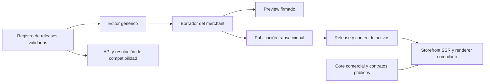

# Themes de VendedorIA: contrato y guía de desarrollo

Contrato v1 · 2026-10-05. Fuente ejecutable: `packages/themes/manifest.schema.json`, `packages/themes/index.js`, `packages/themes/sections.json` y `packages/contracts/index.d.ts`. La [auditoría previa](THEMES-AUDIT.md) explica las decisiones; el [informe de entrega](THEMES-REPORT.md) registra resultados y límites.

## 1. Arquitectura y responsabilidades



| Nivel | Propiedad y responsabilidad |
| --- | --- |
| Core | Tenant, host, permisos, catálogo, precio/stock, carrito, órdenes, pagos, shipping, promociones, recomendaciones, consentimiento, SEO, contratos y componentes comerciales |
| Editor | Controles a partir de schema, composición de inicio, override de campos, estilos, autosave, historial, preview y publicación |
| Theme | Identidad y release, elección de renderer compatible, controles expuestos, tokens default, composición/presets y assets locales declarados |
| Merchant | Catálogo, pedidos/clientes, identidad legal, SEO, branding, fotos/textos propios, FAQ, layouts y configuración comercial |

Un theme v1 es un paquete **declarativo**, integrado al build y revisado en Git. Puede crear una identidad visual y composición sobre `classic@1`, `selecta@1` o `stride@1` sin cambiar el editor ni el comercio. El renderer es un adaptador de plataforma compilado; sus imports internos no son API del SDK. Una presentación con markup nuevo requiere desarrollar y revisar otro renderer de plataforma. No se ejecuta Angular, JavaScript, PHP, Liquid, HTML o CSS suministrado por un merchant.

La separación evita tres copias del negocio. Las tres presentaciones usan el mismo catálogo autoritativo, CartService, reserva/checkout, pagos, consentimiento y contratos. Selecta conserva markup propio y hereda lógica de páginas compartidas; Impulso reutiliza gran parte de las páginas clásicas. La duplicación visual deliberada no implica duplicar reglas de dinero.

## 2. Definición de theme compatible

Para distribuir un paquete deben pasar: JSON/schema cerrado → identidad/versiones → registro de renderer y secciones → contratos ABI → capacidades → rubro → composición/campos/tokens → assets locales → integridad del release → migraciones → builds/tests → revisión visual, SEO, a11y y performance. El panel solo selecciona releases ya incluidos en ese catálogo.

`theme:check` automatiza las comprobaciones declarativas y de archivos. No acredita accesibilidad ni rendimiento de un renderer nuevo: la revisión humana y las pruebas de navegador son una condición de aceptación de plataforma. No hay descarga, instalación ni ejecución de ZIP desde el panel.

## 3. Estructura oficial y API del SDK

```text
theme-starters/<namespace>-<slug>/
  manifest.json             # paquete declarativo completo
  README.md                 # instrucciones del autor

packages/themes/
  catalog.json              # releases distribuidos; append-only
  manifest.schema.json      # definición formal, cerrada
  sections.json             # controles de los renderers de plataforma
  catalog.js / catalog.mjs  # lectura del catálogo (Node / frontend)
  demo-index.mjs            # índice mínimo para detectar demos
  index.js / index.d.ts     # validación, compatibilidad, presets, migraciones
  release-lock.js
  releases.lock.json        # hashes canónicos de releases publicados
  test/themes.test.js
```

No se crean carpetas vacías para componentes, rutas o locales que un paquete declarativo no ejecuta. Las imágenes de portada residen en `apps/web/public/template-previews`. Los assets de las demos originales están en `apps/store/public/template-demos`. CSS revisado de los renderers reside dentro de la app de tienda; su build produce `/selecta.css` y `/stride.css`.

Exports públicos de Node: `THEME_CATALOG`, `THEME_ENVIRONMENT`, `RENDERER_SECTIONS`, `getTheme`, `latestThemes`, `compareVersions`, `validateManifest`, `validateCatalog`, `compatibility`, `migrationPath`, `migrateContent`, `importPreset`. Frontend usa `@vendedoria/themes/catalog`; el índice de demo es `@vendedoria/themes/demo-index`. Los datos son readonly/congelados. No importar Prisma, servicios Nest, rutas de carpetas privadas o funciones Angular internas desde un paquete de terceros.

## 4. Manifest: cada propiedad

Todas las propiedades siguientes son obligatorias, aunque algunas admiten arrays/objetos vacíos. Propiedades desconocidas y claves de prototipo están prohibidas. El URI `$id` del schema es un identificador; no es una promesa de endpoint alojado.

| Propiedad | Regla y propósito |
| --- | --- |
| `schemaVersion` | Entero `1`, versión del formato de manifest |
| `id` | Exactamente `namespace/slug`, identidad permanente |
| `namespace` | Autor/organización técnica; 2–40 caracteres, minúsculas/números/guion, empieza por letra |
| `slug` | Identificador global único en el catálogo, mismas restricciones; sirve para selección y URLs de demo |
| `displayName` | Nombre comercial, 1–80 caracteres; estable entre releases de una identidad |
| `version` | `major.minor.patch`, números sin ceros iniciales, hasta 32 caracteres; no prerelease/build metadata en v1 |
| `author` | Nombre del autor, 1–120 caracteres; no concede permisos |
| `license` | Texto identificador de licencia, 1–80 caracteres; no activa cobros/licensing. Los oficiales usan `UNLICENSED` |
| `description` | Descripción comercial, 1–500 caracteres |
| `renderer` | Presentación y ABI, por ejemplo `classic@1`; debe estar registrada en el ambiente |
| `contracts` | Enteros positivos `engine`, `editor`, `storefront`, `content`; todos `1` en esta entrega |
| `capabilities` | Arrays únicos `requires`, `supports`, `optional`, hasta 40 por lista; identificadores camelCase |
| `industries` | `all` o array no vacío de rubros admitidos; validado al preparar y publicar |
| `sections` | IDs únicos de controles registrados para el renderer; hasta 40; conserva todos sus built-ins |
| `settings` | Opciones de branding admitidas y efectivamente implementadas; lista de hasta 30 |
| `tokens` | Defaults semánticos tipados, solo keys que el theme declara en `settings`; no CSS/URLs libres |
| `assets` | `cover` local de consola y `styles` del renderer compilado, hasta una hoja propia |
| `presets` | 1–12 presets con ID/label/campos/layout válidos; el primero define composición default |
| `migrations` | Hasta 40 aristas explícitas `from` → `to` y `renameFields`; solo avance hacia el release actual |
| `changelog` | 1–30 notas de 1–500 caracteres, en español para el panel |

Rubros actuales: `general`, `belleza`, `moda`, `hogar`, `alimentos`, `tecnologia`, `salud`, `mascotas`, `otros`. Calzado se encuadra en moda; restaurante/alimentos y B2B requieren verificar las capacidades comerciales necesarias. Declarar un rubro no implementa reservas de mesa, listas de precios B2B o POS.

Cada preset tiene `id` (2–40 caracteres), `label`, `sections` (campos de texto/choice conocidos, máximos del renderer) y `layout`. Cada entrada de layout default contiene `id`, `type` y opcional `hidden`; los built-ins aparecen una sola vez, con `id === type`, y solo se ocultan los marcados `canHide`. El paquete no importa opiniones inventadas ni fotos/URLs ajenas. `migrations[].renameFields[]` usa rutas `section.field` registradas.

No se añaden `minCoreVersion`, `maxCoreVersion`, dependencias npm, routes o scripts ficticios. Las dependencias verificables son ABIs, renderer y capabilities. Una actualización del número npm de la app no rompe por sí misma el contrato visual.

## 5. Identidad, versiones y duplicados

`vendedoria/stride` identifica Impulso en todas sus versiones. `slug` es técnico; `displayName` es comercial; `version` identifica un release; `namespace` distingue autor. La tienda guarda slug y versión instalada; el catálogo resuelve su ID completo.

Fork: crea namespace **y slug nuevos**; no reutilices un slug registrado. Clonar para crear un preset no crea otra identidad: añade otro preset al próximo release. Renombrar la identidad/comercial de un theme instalado no es un cambio de metadata permitido; exige un proceso explícito de migración de plataforma y comunicación. Nunca cambies un manifest sellado.

SemVer: patch corrige un preset sin incompatibilidad, minor agrega opciones compatibles, major introduce un cambio que requiere migración. Esto no autoriza romper el renderer antiguo: `classic@1` debe conservar su ABI/semántica. Si cambia el markup o contrato de forma incompatible, registra otro renderer ABI y mantén el anterior mientras haya tiendas dependientes.

`releases.lock.json` guarda SHA-256 del JSON con orden de claves canónico. `theme:seal` agrega hashes de nuevos releases y falla si intenta cambiar/quitar uno sellado; `theme:check` detecta cambios y ausencias. Es control de integridad revisado en Git, no firma de autor ni sandbox. Cambiar manualmente lock y manifest juntos debe rechazarse en revisión.

## 6. Compatibilidad y capacidades

| Estado | Significado y acción |
| --- | --- |
| `compatible` | Contratos exactos, renderer y requerimientos disponibles; permite preparar/publicar |
| `warnings` | Falta una función opcional o soportada; sigue utilizable, con aviso |
| `update_required` | La plataforma ofrece una ABI posterior a la requerida; preparar release compatible antes de publicar |
| `incompatible` | Manifest inválido, release/renderer ausente, ABI futura, requerimiento faltante o rubro no permitido; bloquear publicación y ofrecer recuperación |

La comprobación de ABIs es exacta. Un cambio interno compatible conserva ABI. Una breaking change incrementa la ABI correspondiente y debe venir con adaptador antiguo o migración. El diagnóstico enumera versión requerida/ofrecida y acción. La existencia de un release posterior compatible produce actualización opcional; si el activo está bloqueado, se marca requerida.

| Capability actual | Dato/regla de core que presenta el theme |
| --- | --- |
| `catalog`, `search`, `filters` | Catálogo paginado, categorías/facets, búsqueda y disponibilidad |
| `variants` | Opciones, combinación válida y precio/stock de la selección |
| `cart`, `checkout` | Carrito, shipping, totales, reserva y orden |
| `coupons` | Validación/descuento del core, condicionado por configuración |
| `services`, `digitalProducts` | Tipos de producto reales y reglas de coordinación/entrega |
| `recommendations` | Recomendación del motor comercial cuando está habilitada |
| `whatsapp` | Contacto del merchant cuando existe |
| `seo` | Metadatos y datos estructurados gestionados por core |

Los oficiales requieren `catalog`, `cart`, `checkout`, `seo`. `supports` declara presentación; `optional` permite degradación si falta la capacidad. Disponibilidad de plataforma no equivale a autorización por plan ni activación por tenant: el core sigue aplicando esas reglas. `wishlist`, reviews verificadas, subscriptions, blog, multicurrency, multilanguage y cuentas de comprador no son capabilities disponibles. No anunciar botones que no tengan backend.

## 7. Persistencia, defaults y propiedad de datos

`Storefront`: `template`/`themeVersion` activos, `themeDraftTemplate`/`themeDraftVersion` pendientes, `templateContent` publicado, `templateDraft`, `templatePublishAt`. `StorefrontVersion` guarda contenido y selección reemplazados; veinte snapshots por tienda. La migración `20261005120000_theme_releases` agrega columnas, fija tiendas existentes a `1.0.0` y deja metadata histórica desconocida en `null`.

```json
{
  "version": 1,
  "sections": { "hero": { "title": "Mi tienda", "text": "" } },
  "layouts": { "classic": [{ "id": "featured", "type": "featured" }, { "id": "hero", "type": "hero" }] },
  "theme": { "primary": "#203040", "font": "editorial", "logo": "" },
  "faq": [{ "question": "¿Dónde retiro?", "answer": "En el punto de recojo que elijas." }]
}
```

Ejemplo parcial: el servidor agrega los built-ins faltantes de una composición guardada y aplica límites. Ausente → default del release/renderer/core. Valor explícito → override del merchant. Cadena vacía → ocultar texto/logo permitido; no sustituirla por default con `||`. Branding se resuelve como valores de negocio → defaults del renderer/release → overrides del merchant. Tokens default no reescriben campos comerciales.

Las secciones built-in homónimas comparten copy al cambiar de renderer, como en el sistema original. Layouts están separados por slug. Los campos conocidos de otras presentaciones permanecen guardados aunque no estén expuestos en el release actual. Se eliminan textos de un bloque que el merchant quitó expresamente de todos los layouts. Fotos existentes se conservan; fotos nuevas deben pertenecer al tenant. Versión de contenido futura se rechaza antes de guardar/publicar.

Los presets llenan **solo campos ausentes**; conservan texto vacío, branding, FAQ, composición existente y fotos propias. Los defaults que el merchant importó pasan a ser datos de su tienda y sobreviven a actualizaciones. Producto/precio/stock/cliente/pedido nunca forman parte de un preset ni migración de theme.

## 8. API, ciclo de vida y administración

Base `/api/v1`; rutas administrativas con autenticación y tenant obtenido del token, integración Tienda web habilitada. Nunca enviar `tenantId` en el body.

| Método/ruta | Contrato |
| --- | --- |
| `GET /store/themes` | Releases distribuidos, estado activo/en edición, compatibilidad, update/changelog y `savedAt` |
| `POST /store/themes/draft` | `{template, version, preset?, savedAt?}`; validar, migrar/importar y preparar borrador |
| `GET /store/editor` | Schema exacto del release en edición, opciones/defaults/composición, contenido, estado y frame firmado |
| `PUT /store/editor/draft` | `{content, savedAt?}`; contenido normalizado y revisión |
| `POST /store/editor/publish` | `{savedAt?}`; activar selección y contenido juntos con snapshot previo |
| `POST /store/editor/discard` | `{savedAt?}`; eliminar pendientes y programación |
| `PUT /store/editor/schedule` | `{publishAt, savedAt?}`; entre 5 minutos y 90 días |
| `DELETE /store/editor/schedule` | `{savedAt?}`; cancelar programación |
| `GET /store/editor/versions` | Hasta veinte snapshots con fecha e identidad nullable del legado |
| `POST /store/editor/versions/:id/restore` | `{savedAt?}`; restaurar en borrador, limitado al tenant |
| `PATCH /store` | Configuración comercial/branding/SEO; selección de template ahora queda pendiente |
| `POST /store/publish` | Checklist comercial existente y publicación inicial de diseño pendiente |

Cada respuesta de estado devuelve `savedAt`. La consola lo manda en todas las mutaciones. Un cliente antiguo puede omitirlo por compatibilidad, pero no obtiene protección contra sesiones que ya cambiaron antes de empezar su solicitud. Incluso sin revisión cliente, el servidor compara la fila leída al escribir; publish reclama la fila en transacción. Conflicto → HTTP 409 y mensaje para reabrir editor. No reintentar sobrescribiendo con una revisión nueva automáticamente.

Flujo: crear tienda → elegir → guardar selección en borrador → importar muestra opcional → editar → autosave → iframe/preview → publicar diseño → publicar tienda tras checklist → visitar host → preparar update → revisar → publicar. Configuración comercial de `/store` sigue el comportamiento existente; no es parte del borrador visual.

El panel muestra activo/en edición, versión, autor, funciones, compatibilidad y notas; ofrece preparar actualización, importar preset y recuperar con Clásica. Nunca publica un update automáticamente solo porque se añadió al catálogo. Un borrador ya preparado se identifica para evitar repetir la actualización. La consola recarga schema/iframe al restaurar identidad o descartar un cambio de theme.

## 9. Preview, bridge y safe mode

Preview/editor conserva HMAC por tenant, expiración, cookie httpOnly y aislamiento del host. `StoreEditorHostMessage`/`StoreEditorFrameMessage`, `StoreEditorSnapshot` y controles están en `packages/contracts/index.d.ts`; el bridge valida source/origin y versión `1`. Es transporte de edición, no una API para que un theme ejecute código o consultas.

El comprador recibe `StoreThemeRelease` reducido: ID, slug, versión, renderer, tokens, composición default y `safeMode`. No recibe todo el catálogo, migraciones o configuración del editor. Renderer ausente/release incompatible/rubro inválido → Clásica 1.0.0 como presentación de recuperación. Se conserva la identidad original y el JSON en DB. La composición del fallback prevalece durante safe mode; no se sobreescribe el layout guardado de la plantilla rota.

El merchant puede preparar un release válido del mismo ID o Clásica y publicarlo. Safe mode cubre incompatibilidad declarativa; no es una frontera que capture cualquier excepción de JavaScript, caída de DB o error arbitrario de SSR. Los renderers compilados deben pasar pruebas antes de distribución; monitoreo de errores SSR pertenece al despliegue de plataforma.

## 10. Componentes, templates, sections y blocks

Las rutas comerciales son del core: inicio, `/productos`, `/producto/:handle`, `/carrito`, `/checkout`, `/pedido/:id`, legal y recibos. El theme selecciona la presentación; no redefine endpoints ni rutas de pago. No hay constructor de páginas/blog arbitrarios en v1.

`StoreEditorSection`: `id`, `label`, `role`, `canHide`, `faq`, `fields` y `page?`. Roles:

- `builtin`: sección de inicio de identidad única y reordenable; ocultación solo si permitida. Producto destacado permanece accesible.
- `block`: bloque de biblioteca repetible, ID `type-xxxxxx`, hasta ocho añadidos por layout.
- `fixed`: fuera de la composición de inicio, por ejemplo anuncio/header, navegación, redes, footer y copy de producto.

Campos: `id`, `label`, `kind`, `maxLength`, opciones y ayuda/default cuando corresponde. `text`/`multiline` son texto escapado, `image` upload propio, `choice` enum conocido, `url` destino social HTTPS permitido. Cada tipo tiene props/defaults en el schema y un renderer; no se serializan componentes ni callbacks.

Biblioteca compartida: imagen+texto, texto, beneficios, testimonios aportados por merchant, WhatsApp, galería, CTA y preguntas (según renderer). Composición plana de inicio → sección/bloque → componente. No hay árbol libre, slots de código, breakpoint editor por campo ni reglas arbitrarias de visibilidad. Responsive corresponde al renderer y tokens; `hidden` es global.

Crear componente/section nueva es trabajo de plataforma: definir contrato y campo/rol/default/limites en `sections.json`, añadir presentación accesible y binding al runtime, integrar biblioteca común o adapter, actualizar ABIs si rompe, preparar nuevos releases opt-in y comprobar que antiguos siguen funcionando. No copiar checkout para resolver una diferencia visual. Mantener IDs/props viejos mientras tengan consumidores. Los renderers deben listar todas sus secciones built-in en presets; los paquetes pueden ordenarlas/ocultarlas donde sea permitido, no fingir componentes que no renderizan.

## 11. Design tokens y settings

| Setting | Valores y efecto |
| --- | --- |
| `logo`, `favicon` | Upload del tenant, `''` para ausencia; favicon llega al head mediante SEO del core |
| `primary`, `accent` | `#RRGGBB`; marca/CTAs y acento. Foreground sobre marca escoge blanco/negro por contraste |
| `background`, `surface`, `text`, `muted`, `border` | Colores semánticos; fondo, superficies, cuerpo, secundarios y límites |
| `font` | `modern` (Manrope), `editorial` (system+Georgia), `simple` (system); sin URL de fuentes de terceros |
| `corners` | `square`, `soft`, `round`; radios de controles/cards con adaptación del renderer |
| `container` | `compact` (64rem), `standard` (75rem), `wide` (90rem); conserva límites móviles |
| `spacing` | `compact`, `standard`, `airy`; ritmo vertical mediante variables/clamp |
| `typeScale` | `standard`, `large`; escala legible de cuerpo/caption |

`StoreThemeTokens` aplica variables acotadas; `storeTheme` hace merge de release/merchant. `storeBrand`, `THEME_FONTS`, `THEME_CORNERS` y shells adaptan las identidades existentes. Usar `--store-*` y `--ds-*`; Selecta mapea variables semánticas a su paleta local. Los tokens nuevos se exponen en releases 1.1.0; 1.0.0 mantiene sus opciones originales.

Sombras, pesos tipográficos, escalas de headings, states de botones/inputs/cards/links y comportamientos responsive se gobiernan por design system/renderer. No son todos sliders del merchant. Agregar uno requiere schema acotado, control y consumo real en cada renderer que lo declare. Se mantienen decisiones visuales y CSS legado deliberados; esto no elimina cada literal de Selecta ni convierte todas sus decoraciones en tokens editables.

Header admite tres entradas de navegación con destinos `/`, `/productos`, `/carrito`, `/legal`. Footer permite textos de cierre/nota y redes Instagram/Facebook/TikTok con HTTPS/host exacto, preserva enlaces legales y contacto del negocio. SEO, nombre, contacto y condiciones comerciales se editan en Tienda web; banners/fotos/textos/FAQ/composición en Editor. No se puede ocultar información legal obligatoria cambiando la plantilla.

Colores arbitrarios válidos no garantizan contraste entre texto/fondo elegidos por el merchant. Revisar pares al crear presets y antes de publicación de un diseño: el algoritmo de marca asegura su foreground, no todos los pares semánticos posibles.

## 12. Dynamic data y motor comercial

Los tipos públicos incluyen `StorefrontView`, `StoreCatalogProduct`, `PublicCatalogCard`, selección/facets/detalles y orden pública autorizada. El core mapea Prisma → DTO público; el renderer consume ese contrato. Nombre/imagen/precio/url de ProductCard provienen de producto real, no de presets. Colecciones se representan por filtros/categorías reales. Carrito/selección/shipping se resuelven por servicios compartidos.

No hay lenguaje de expresiones `product.price` evaluado desde un manifest. Binding está implementado y revisado en componentes Angular tipados. No se entrega lista de clientes/pedidos privados al theme; la página de pedido requiere la autorización existente. Page/BlogPost y customer accounts no existen como API del SDK.

Recomendaciones/cross-sell/upsell existentes pertenecen al motor de conversión; la presentación no calcula ranking ni inventa promociones. Reglas de descuento, sets, stock, shipping gratuito y tipos service/digital son del core. Order bump/downsell/wishlist/back-in-stock no se agregan ficticiamente en esta entrega.

## 13. Demos y presets

`/_templates/{slug}/` funciona para todo slug registrado mediante índice generado mínimo. Usa productos/fotos **locales de demostración** del renderer, cart local y checkout deshabilitado para compras. No consulta catálogo real, manda mensajes, escribe pedidos, acepta pagos ni carga tracking. Demo sirve para explorar la presentación; sus inventarios son un entorno separado.

Importar desde el panel aplica el preset editorial del release al borrador, preservando overrides. El preset admite copy/composición/tokens; no importa los productos/fotos del demo al comercio. Una plantilla para otro rubro puede crear varias muestras/presets dentro de una identidad; el primer preset sigue definiendo el default. Un catálogo de demostración propio exige un fixture de plataforma separado y pruebas de aislamiento, no meter datos comerciales en `presets`.

## 14. Updates y migraciones

1. Añadir nuevo manifest bajo el mismo ID/slug/nombre; conservar todos los anteriores.
2. Declarar notas y una ruta de migración si cambia versión instalada. Desde 1.0.0 a 1.1.0 oficiales, la migración es explícita y sin cambios de campos.
3. Validar catálogo y sellar nuevo release; regenerar frontend/índice demo.
4. Probar actualización desde cada origen soportado con contenido vacío, textos/imagenes, overrides vacíos, FAQ, bloques, layout, branding y comercio existente.
5. Distribuir build; el panel avisa. Preparar → preview → publicar es opt-in.

Las aristas pueden ser secuenciales o directas. `migrationPath` busca una ruta declarada; no supone compatibilidad por comparar SemVer. `migrateContent` trabaja en una copia y ejecuta renames en orden; si destino ya contiene override, falla sin persistir. No ejecuta scripts, deletes o SQL. Solo campo conocido `section.field`; rutas de prototipo se rechazan también en runtime. Si una transformación no cabe en renames seguros, diseñar una migración de plataforma explícita con backup/validación.

No hacer downgrade automático ni migración inversa inventada. Rollback del diseño es restaurar snapshot compatible en borrador y publicar. Un snapshot legado sin selección aplica copy sobre el theme activo, pues no se conoce el original. Los snapshots no son backup de DB: conservar los backups operacionales habituales.

Publicación transaccional registra selección+contenido anteriores, reclama `updatedAt`, activa selección+contenido juntos y limpia pendientes. El sweep se ejecuta cada minuto, máximo cincuenta tiendas; una incompatible no bloquea las demás. Una programación cancelada/reprogramada se vuelve a comprobar dentro de transacción.

## 15. Seguridad, permisos y supply chain

Permitido: JSON cerrado, texto escapado, enums, colores hex, composición registrada, media propia, assets locales declarados y migraciones de campos conocidas. Prohibido: callbacks/scripts, `eval`, HTML libre, CSS libre/remoto, iframe de terceros, ZIP executable, imports privados, SQL, SVG arbitrario, rutas absolutas/traversal y nuevos destinos de checkout.

Las imágenes siguen el pipeline existente de upload (normalización WebP), ownership por tenant y límites; favicon reutiliza ese flujo. Los presets no aceptan fotos ajenas. Enlaces sociales no se descargan desde servidor, evitando SSRF; solo dominios exactos HTTPS sin userinfo/puerto. Abrir enlaces externos usa `noopener noreferrer`. Navegación interna está enumerada. Prototype pollution se bloquea en schema y migraciones.

Autenticación, tenant scoping, preview firmado, CORS/CSP/headers y proxy allowlist continúan en core. Las rutas no reciben tenant desde cliente ni crean permisos por author/namespace del manifest. Las llamadas administrativas siguen bearer/auth del producto; no se habilita una instalación con cookie anónima. Configurar TLS, cookies y origen de consola en producción sigue siendo responsabilidad de despliegue. No se cambiaron mecanismos de auth, roles o secreto del preview.

Manifest/hashes no aseguran la integridad de código nuevo de renderer; revisión, lock de dependencias, CI y despliegue controlado sí son necesarios. No hay firma de publishers, descarga de updates o sandbox de JS en v1. Nunca guardar credenciales en un theme, fixture publicado, nota de release o log.

## 16. Calidad: UX, a11y, SEO y performance

Aceptación de un nuevo renderer requiere inicio/catálogo/producto/carrito/checkout/legal, estados vacío/loading/error/retry/success, todas las URLs comunes y datos reales. Probar 390px, tablet y desktop, texto largo, imágenes ausentes, catálogo sin stock, variantes y shipping modificado. CTAs concretos y visibles; checkout conserva el total autoritativo y consentimiento explícito. Contraste/touch/foco no se sacrifican por identidad visual.

A11y: semántica/headings/landmarks, names de controles, labels+errores asociados, teclado/foco visible, dialogs/menu accesibles, alt útil (decoración alt vacío), no información solo por color, zoom y reduced-motion. Objetivo WCAG 2.2 AA; contraste texto ≥4.5:1 y texto grande ≥3:1. `theme:check` no certifica WCAG. Revisar manualmente cada presentación/preset significativo y ejecutar herramientas a11y de CI cuando se incorporen; no ofrecer badge automático por manifest.

SEO permanece en `core/seo.service.ts` y `src/server.ts`: título/descripción/canonical/Open Graph, producto/organización/breadcrumbs según página, robots/sitemap/indexación. Renderer no elimina head ni inventa ratings/schema. Favicon es branding y lo aplica el core. Comprobar source SSR, canonical del host real y demo/preview sin indexación. Las URLs y paginación del catálogo conservan el flujo compartido.

Performance: SSR por request, hydration Angular y lazy routes de renderer; CSS local por presentación, fonts acotadas, imágenes WebP con dimensiones/alt y lazy donde corresponde. Catálogo completo de manifests fuera del bundle inicial comprador; índice demo mínimo generado. Evitar una llamada por card, preload indiscriminado, JS remoto y dependencias por theme. Caching/host y preview pertenecen al servidor; no cachear preview como respuesta pública. La optimización adicional de critical CSS, fuentes/imagenes y caché requiere medir entorno de producción.

Los budgets existentes en `apps/store/angular.json` y `apps/web/angular.json` son límites de build; no aumentarlos para ocultar warnings. Registrar inicial/gzip y CSS por renderer al revisar cambios. El informe contiene los warnings encontrados. Medir LCP/INP/CLS con carga real antes de un go-live; no extrapolar tiempos de localhost ni screenshot a Core Web Vitals.

Conversión: recomendaciones/relacionados del core, información de variantes, stock real bajo solo cuando es real, beneficios de producto, shipping gratuito desde configuración y CTA claro. Mostrar testimonios solo suministrados por el merchant. Sin countdown fabricado, ratings inventados, descuento inexistente, newsletter sin entrega o suscripción preseleccionada. Demos deben mostrar su condición de ejemplo y no aceptar compras.

## 17. Tutorial: crear un theme desde cero

Requisitos: Node ≥22, npm workspaces y checkout de VendedorIA; stack Docker para validación integrada. No instalar otro framework ni SDK de ejecución. El starter oficial viene con el repo.

```sh
npm run theme:create -- estudio/tienda-local
npm run theme:check -- theme-starters/estudio-tienda-local/manifest.json
```

1. Abre `manifest.json`. Define author/licencia/nombre/description propios; conserva `estudio/tienda-local` y slug único. El starter clona la definición de Clásica compatible; versión inicial `1.0.0`, sin migraciones.
2. Cambia tokens, por ejemplo `primary: "#203040"`, `font: "editorial"`, `container: "compact"`. Deben aparecer en `settings`. No añadas tokens inventados o URLs de fuentes.
3. Personaliza `presets[0].sections.hero` con copy neutral propio. Ordena entradas del layout conservando todos los built-ins. Para ocultar hero usa `hidden: true`; no ocultes una sección `canHide: false`. Añade presets con IDs únicos si ofrecen otra composición/copy, dentro del mismo theme.
4. Si prefieres Selecta/Impulso, empieza de su manifest y conserva sus secciones/preset/styles/rubro. No basta cambiar `renderer` sobre un layout de otra familia. Usa schema/controles de esa familia; no necesitas estudiar servicios de commerce.
5. Valida el archivo. El check standalone verifica manifest/compatibilidad/assets; la comprobación de conflictos globales/ancestros sucede al integrarlo en catálogo. Aporta portada local en `apps/web/public/template-previews` si cambias `assets.cover`.
6. Packaging v1: `manifest.json` + README/licencia y portada local, en PR de integración. Agrega **el objeto** al array `packages/themes/catalog.json`, mantén releases anteriores. No se publica un paquete npm remoto ni se sube ZIP al panel.

```sh
npm run theme:seal
npm run theme:build
npm run theme:check
npm run theme:test
npm run theme:test:store
npm run build:api
npm run build:web
npm run build:store
npm run test:docker
```

Si trabajas Docker-first, ejecuta los scripts desde `/app`, por ejemplo `docker compose -f docker-compose.dev.yml exec -T -w /app store npm run theme:test:store`. `test:docker` usa la DB aislada y requiere el stack activo; no apuntar fixtures a la base de datos comercial. El warning Node de detección de módulos de las pruebas strip-types es informativo, no un fallo de theme.

7. Verifica `http://localhost:4300/_templates/tienda-local/` y las rutas de compra como demo. En consola, una tienda del rubro permitido podrá seleccionar el nuevo slug porque picker/API/registro usan el catálogo común. Importa la muestra, edita copy/layout/tokens, prueba preview y publicación sobre fixture desechable.
8. Documenta resultados de teclado/contraste/responsive/SEO/bundle y revisión de seguridad. No aceptes nueva presentación con errores graves. El lint del root tiene `--fix`; no usarlo a ciegas para reformatear todo el repo. Los paquetes JSON se validan con `theme:check`; builds comprueban TypeScript/template/style.
9. Para el siguiente release, duplica el objeto, cambia solo `version`/mejoras/notas y agrega migración explícita desde el release previo (`renameFields: []` si no cambia contenido). Repite sellado/validación/tests. El merchant decide cuándo aplicarlo.

## 18. Guía interna: evolución del core y extensiones

No romper sin cambio de ABI: IDs/roles/props, significado de `''`, shapes públicos, claves del contenido, transportes preview, resolución de host, semántica de cart/checkout ni interpretación de tokens/renderers. ABI engine/editor/storefront/content es independiente de SemVer theme.

Para deprecar, inventariar releases distribuidos y stores instaladas; mantener lectura/adapter antiguo, exponer advertencia documentada, publicar sucesor+migración y permitir rollback. No retirar un renderer/sección durante la misma release que anuncia reemplazo. Los releases sellados conservan metadata; compatibilidad la determina el ambiente/adapter disponible.

Nueva capability: primero implementar regla/DTO/backend y autorización por tenant; después añadir al ambiente, integrar componente común y revisar renderers que declaran soporte. Capability opcional ausente debe ocultar/degradar presentación; ninguna lista concede plan ni acceso. Tipo de producto nuevo: contrato público discriminado, core checkout/fulfillment, fixture y renderer con estado claro; nunca forzar una variante de producto física ficticia.

Nuevo bloque: registry de props/defaults/rules, componente compartido, biblioteca/editor/runtime y prueba de cada familia; introducirlo en manifests nuevos. Nuevo renderer: adapter completo de todas las rutas/bloques que anuncia, styles scoped, contratos públicos, compilación lazy y pruebas comerciales/SEO/a11y. Sus clases internas siguen privadas; terceros consumen el nombre/version del adapter.

No hay bus público de hooks JS. Los extension points v1 son renderer/capabilities/sections/presets registrados y bridge tipado de plataforma. Futuras apps deben suministrar slots declarados y APIs autorizadas del core, con revisión de capacidades y degradación; no scripts que muten stock/totales desde tema. Marketplace puede reutilizar identity/author/license/releases/compatibility, pero necesitará firma, distribución, entitlement, verificación y gestión de retirada. No confundir preparación del modelo con marketplace implementado.

## 19. Testing y operación

Pruebas: `packages/themes/test/themes.test.js` (schema/identidad/releases/ABIs/capacidades/presets/migraciones), `apps/api/src/storefront/store-templates.spec.ts` (sanitización), `apps/store/test/theme-runtime.test.mjs` (contraste/tokens/nav/demos/composición/fallback), `apps/api/test/theme-lifecycle.e2e-spec.ts` (HTTP+PostgreSQL aislado, todas las familias), pruebas de editor de consola y suites existentes de editor/preview/host/comercio. CI incorpora builds de las tres apps y checks/tests de themes/runtime; la suite DB completa se ejecuta local con Docker.

Logs de theme: `theme_operation`, operación, ID, versión, resultado y versiones de contratos. No emails, teléfonos, chats, fotos, tokens de preview ni payloads del merchant. Stage/publish/error de compatibilidad/migración y programación se identifican sin PII. Publicación exitosa se registra después del commit. Un fallo SSR de código compilado conserva el diagnóstico de plataforma, no se convierte silenciosamente en éxito.

Despliegue: backup habitual → migraciones aditivas con `prisma migrate deploy` → generar client/builds/checks → distribuir API/consola/store coherentes. No actualizar solo la consola para introducir un contrato nuevo. Verificar `/health`, resolución de host, store activo y fixture preview. En Docker dev, reiniciar API si el watcher no incorpora rutas nuevas. No cambiar env ni integrar proveedores reales para probar themes.

Esta especificación admite evolución incremental; no garantiza reproducción visual pixel-perfect de un renderer si se cambia su código compartido. Cambios incompatibles deben conservar el adapter anterior, y los warnings de performance o pruebas comerciales ajenas pendientes se documentan en el informe.
