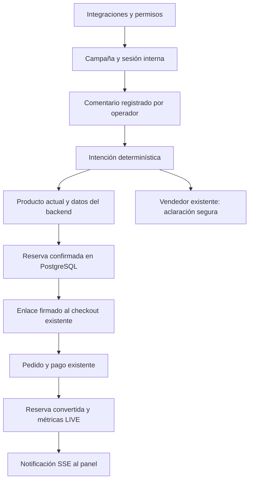

# TikTok LIVE · AI Seller

## Alcance real

La integración usa el catálogo, inventario, conversaciones, vendedor IA, tienda, pedidos y pagos existentes. El negocio activa `tiktok_live` desde Integraciones, con Tienda web activa y un plan que la incluya (Crece, Escala, Lidera y prueba de Crece). La autorización de una cuenta TikTok y las ventas manuales son funciones distintas: se puede operar una campaña sin OAuth.

El operador transcribe comentarios, revisa sugerencias y confirma reservas. La consola no lee comentarios de TikTok, no envía respuestas y no inicia la transmisión. `delivered: false` identifica los registros internos. No hay scraping, automatización de TikTok ni APIs privadas.

| Capability del adapter | Estado actual | Qué significa |
| --- | --- | --- |
| identity | supported con `user.info.basic`; pending_approval sin autorización | Login Kit identifica la cuenta |
| webhooks | supported con autorización; pending_approval sin ella | Solo `authorization.removed`, con firma oficial |
| liveSessions | unsupported | Inicio/fin del panel son operaciones internas del negocio |
| inboundComments / outboundReplies | unsupported | Registro y envío manual por el operador |
| liveProducts / shopOrders / productSync | pending_approval | Requieren acceso al producto oficial correspondiente y un adapter adicional; no están implementadas |

Conectar Login Kit no concede permisos de TikTok Shop ni de comentarios LIVE. `AUTO` se rechaza mientras `outboundReplies` no sea `supported`; hoy solo funcionan `HUMAN_APPROVAL` y `HUMAN_ONLY`.

Fuentes oficiales verificadas el 5 de octubre de 2026: [Login Kit web](https://developers.tiktok.com/docs/en/login-kit-web/), [OAuth y refresh](https://developers.tiktok.com/docs/en/oauth-user-access-token-management/), [scopes](https://developers.tiktok.com/docs/en/tiktok-api-scopes/), [firma de webhooks](https://developers.tiktok.com/docs/en/webhooks-verification/), [eventos](https://developers.tiktok.com/docs/en/webhooks-events/) y [TikTok Shop Partner Center](https://partner.tiktokshop.com/). Antes de habilitar nuevas capabilities, volver a verificar el producto, permisos, mercado y formato oficial; la lista pública de Login Kit no acredita acceso a comentarios LIVE.

## Arquitectura encontrada y reutilizada

Monorepo npm: NestJS/Fastify/Prisma/PostgreSQL en `apps/api`, consola Angular en `apps/web` y tienda Angular SSR resuelta por host en `apps/store`. JWT aporta el tenant y el rol; la tienda obtiene el tenant del host/slug validado. `TenantIntegration`, el catálogo de planes, las dependencias entre integraciones y el menú dinámico siguen controlando la activación.

`LiveService` es el motor comercial. Depende de `LiveIntegrationAccess`, no del cliente OAuth de TikTok; `LiveModule` vincula esa interfaz a `TikTokIntegrationService`. `LiveChannelAdapter` declara capabilities y salida; `TikTokLiveAdapter` rechaza la salida no soportada. La siguiente integración deberá aportar su configuración, validación de entrada oficial y binding del adapter sin reescribir reservas o pagos. El esquema/configuración actual admite una integración TikTok por tenant; multicanal simultáneo necesitará extender esa configuración.



No se crea otro sistema de pago ni otra bolsa de inventario. Redis/BullMQ y Qdrant pertenecen a los motores de conversión existentes; LIVE utiliza transacciones PostgreSQL, el barrido de vencimientos del checkout y el transporte SSE autenticado de la bandeja.

## Operación

1. Publicar la tienda y habilitar sus cobros en línea. En producción, conectar la cuenta Mercado Pago del negocio; el modo de desarrollo usa el simulador existente.
2. Activar Tienda web y TikTok LIVE en Integraciones. Configurar atención, TTL (60–900 segundos, 300 por defecto) y límite de reservas (1–5000 por sesión).
3. Crear una campaña Venta LIVE o Liquidación LIVE. Seleccionar productos físicos publicados, disponibles y en PEN; elegir variante cuando corresponda. Definir precio LIVE, unidades asignadas, máximo por comprador, orden y duración desde el inicio. El precio de catálogo se consulta, no se duplica como fuente comercial.
4. Iniciar la sesión desde la consola, respetando sus fechas. Iniciar la transmisión por separado en TikTok. Las ofertas se vuelven inmutables al iniciar; para cambiar condiciones crear otra campaña.
5. Seleccionar rápidamente el producto actual. Registrar el comentario y un alias consistente del comprador. Reglas determinísticas clasifican compra/cantidad, precio, stock, envío, pago, información, cancelación o consulta por aclarar.
6. Revisar sugerencias. Precio y stock salen del backend y se vuelven a consultar al aprobar. En consultas ambiguas, el vendedor IA existente solo selecciona una pregunta de aclaración permitida; no produce condiciones comerciales ni crea pedidos. La cuota IA existente se respeta.
7. Confirmar la reserva y compartir su enlace firmado únicamente con ese comprador. La intención de compra por sí sola no afirma que se reservaron unidades. Las cancelaciones de intención requieren una acción humana sobre la reserva.
8. El comprador completa sus datos, entrega y pago en `/live-checkout`, que usa el checkout clásico compartido incluso si la tienda usa otra plantilla. El carrito de esta ruta es temporal y no reemplaza el carrito habitual ni sus cupones/recordatorios.
9. El pedido queda vinculado a reserva, sesión, campaña, oferta y conversación; usa canal `TIKTOK_LIVE`. Los handlers existentes de Mercado Pago, conciliación, vencimiento y cancelación aceptan este canal. Al confirmar el pago, la reserva pasa a `CONVERTED` una sola vez.

El alias se normaliza y almacena como HMAC del tenant. El límite por comprador se aplica por alias y sesión; no verifica la identidad real del usuario de TikTok. El operador debe utilizar el mismo alias, y no confundir este control con un límite global por persona.

El panel muestra mensajes, intención, precio normal/LIVE, stock, reservas, checkouts, ventas, ingresos, conversión, unidades y resultados por producto. Las listas muestran los últimos 50 mensajes y 100 reservas; los agregados cubren toda la sesión. Ingresos totales incluyen entrega; ingresos por producto corresponden a unidades pagadas por su precio LIVE. Agotado representa disponibilidad actual cero, incluyendo oferta vencida o retirada.

## Inventario, idempotencia y pagos

- Crear una reserva bloquea la sesión y actualiza `LiveOffer.claimedQty` de forma condicional. `withAllocations` y `reserveStock` usan el inventario existente, incluidos componentes de sets, dentro de la misma transacción. La asignación a una campaña es un techo comercial, no un descuento anticipado del stock.
- El stock anunciado es el menor entre disponibilidad del catálogo y asignación restante. Stock cero, producto retirado, oferta vencida, exceso por comprador o límite de sesión bloquean la reserva. Cantidades y dinero son enteros; el precio se conserva en la reserva y el pedido.
- `idempotencyKey` es único por tenant y se valida contra sesión/oferta/comprador/cantidad. Un reintento idéntico recupera la reserva pendiente; uno con otros datos o con reserva cerrada devuelve conflicto.
- El token del enlace está firmado con HMAC, vinculado al tenant y al vencimiento. Obtener sus datos usa POST, evitando ponerlo en el query string del API. La tienda aplica `no-referrer` y `private, no-store` al enlace LIVE. Las URLs del logger API omiten queries, cookies y autorización.
- El checkout bloquea la reserva antes de transferirla a un pedido. El inventario ya separado no se vuelve a descontar. No admite combinar precio LIVE con cupón o recuperación de carrito. La clave de checkout se guarda por reserva para conservar reintentos sin mezclar compras habituales.
- Estados: `PENDING → CHECKED_OUT → CONVERTED`; antes del pedido, `PENDING → EXPIRED/CANCELLED`. Al liberar un pedido, el checkout devuelve el stock y el helper LIVE libera solo la asignación, una vez.
- El barrido existente vence reservas pendientes y pedidos sin pago en curso. No se inicia otro worker por tenant. Desactivar la integración bloquea operaciones nuevas y su SSE; las reservas vencen normalmente y los pedidos ya creados conservan su flujo de pago.
- Terminar una sesión bloquea reservas nuevas. Los enlaces emitidos conservan su vencimiento original. La fecha final de campaña también bloquea operaciones nuevas; el estado persistido de sesión se termina mediante la acción del operador.
- Un pago confirmado después de cancelar se mantiene en el tratamiento existente `paid_late`, para revisión, y no recupera inventario ni convierte una reserva ya liberada. Un reembolso se refleja en el estado existente del pago y requiere la operación de devolución del negocio; no modifica automáticamente el inventario LIVE.

SSE consulta eventos durables y disponibilidad cada dos segundos y envía solo el ID de sesión; la consola recarga el panel con JWT. Hay heartbeats y reconexión mediante `InboxStreamService`. No se envían mensajes/PII en las notificaciones. Un futuro volumen alto puede justificar invalidación por un bus compartido, conservando el protocolo.

## OAuth y configuración

Configurar únicamente mediante los mecanismos de entorno existentes; ambos archivos `.env*.example` incluyen placeholders:

| Variable | Uso |
| --- | --- |
| `TIKTOK_CLIENT_KEY` | Client key de la aplicación oficial |
| `TIKTOK_CLIENT_SECRET` | Secret de esa aplicación; solo backend |
| `TIKTOK_REDIRECT_URI` | HTTPS exacto registrado, terminado en `/api/v1/integrations/tiktok-live/oauth/callback` |
| `PAYMENT_CREDENTIALS_KEY` | Clave de cifrado existente, 32 bytes; mantenerla estable |
| `CORS_ORIGIN` | Un único origen HTTPS de la consola cuando OAuth está configurado |
| `PUBLIC_API_BASE_URL` | Base pública del API, incluido `/api/v1`, para mostrar el webhook |
| `JWT_ACCESS_SECRET` | Secreto existente para JWT y enlaces firmados; no cambiarlo durante reservas activas |
| `STOREFRONT_URL_TEMPLATE` | Dominio público existente de tiendas; se respeta el dominio propio activo |
| `OPENAI_API_KEY` / `OPENAI_MODEL` | Configuración existente, opcional para aclaraciones |

Dar de alta Login Kit, registrar el redirect y obtener aprobación para `user.info.basic`. Registrar el webhook HTTPS `/api/v1/webhooks/tiktok` en TikTok. El servidor puede validar firma/configuración, pero no puede confirmar por sí mismo que el endpoint fue registrado en el portal externo.

La conexión genera `state` aleatorio con hash y TTL de 10 minutos. Una cookie HttpOnly/Secure/SameSite=Lax lo vincula al navegador; la llamada Angular usa `withCredentials`. El callback compara cookie/state, consume el estado una vez y cifra access/refresh tokens con el AES-256-GCM existente. No se devuelven tokens al frontend. Un intercambio fallido también consume ese intento. HTTPS es necesario para la cookie; usar dominios HTTPS de desarrollo registrados si se prueba OAuth local.

Validar conexión refresca tokens próximos a vencer, bajo bloqueo de la configuración; persiste la rotación aunque la posterior consulta de identidad falle. No hay refresco periódico innecesario: el operador puede validar o reconectar. Desconectar revoca mediante el endpoint oficial y elimina credenciales locales; si TikTok no responde, se informa del error y se conserva la autorización para reintentar.

`authorization.removed` exige el raw body y firma `TikTok-Signature`, HMAC-SHA256 del timestamp y cuerpo exacto, con tolerancia de cinco minutos. Se valida client key y cuenta, y se deduplica por tenant/cuenta/tipo/fecha del evento, independientemente del formato JSON. Desconecta todas las vinculaciones activas de esa cuenta; integraciones desactivadas no procesan eventos.

No se realizó una autorización contra una cuenta real: faltan la aplicación y sus credenciales/aprobación externas. Las pruebas de OAuth usan un cliente oficial simulado, sin salir a TikTok; las pruebas de pago ejercitan los handlers existentes con notificaciones ficticias de Mercado Pago.

## API y permisos

Todos estos paths están bajo `/api/v1`. JWT obtiene tenant/rol; ningún DTO permite `tenantId`.

| Método y path | Permiso / propósito |
| --- | --- |
| GET / PUT `integrations/tiktok-live` | Lectura del negocio; escritura OWNER/ADMIN |
| POST `integrations/tiktok-live/connect`, `verify` | OWNER/ADMIN |
| DELETE `integrations/tiktok-live/connection` | OWNER/ADMIN |
| GET `integrations/tiktok-live/oauth/callback` | Público; cookie + state de un solo uso |
| POST `webhooks/tiktok` | Público; firma oficial obligatoria |
| GET / POST `live/campaigns` | Lectura del negocio; creación OWNER/ADMIN |
| PUT `live/campaigns/:id` | OWNER/ADMIN, solo borrador |
| POST `live/campaigns/:id/start` | Operador del tenant |
| GET `live/sessions/:id`, `live/sessions/:id/stream` | Operador del tenant, SSE autenticado |
| PATCH `live/sessions/:id/current-product` | Operador, oferta de la misma campaña |
| POST `live/sessions/:id/end`, `messages`, `reservations` | Operador; rate limit en mensajes/reservas |
| POST `live/messages/:id/approve` | Operador; revisión interna, no envío |
| DELETE `live/reservations/:id` | Operador; reservas sin pedido |
| POST `storefront/:slug/live-reservation` | Público; tienda validada + token firmado, rate limit |

Pedidos y cobros siguen en `storefront/:slug/checkout`, `orders/:id/*` y los endpoints existentes de pagos/conciliación. Swagger registra los controllers/DTOs en `/docs`. La bandeja no permite reactivar el agente ni enviar plantillas/textos a un canal LIVE sin salida oficial.

## Base de datos y despliegue

Migración aditiva `20261005020000_tiktok_live`: tablas `LiveIntegration`, `LiveCampaign`, `LiveOffer`, `LiveSession`, `LiveReservation` y `LiveEvent`; relaciones con Tenant/Agent/Product/Variant/Order, claves compuestas de tenant, índices/idempotencia, checks de dinero/cantidades/estados y una sesión activa por campaña. Añade `TIKTOK_LIVE` a `ChannelType` y `OrderChannel`. Conserva el snapshot de la asignación en JSON para restaurar exactamente las unidades tomadas.

La migración y la anterior de conversión ya están aplicadas al stack local y a `vendedoria_test`. Para otro entorno:

```sh
docker compose -f docker-compose.dev.yml exec -T api npx prisma generate
docker compose -f docker-compose.dev.yml exec -T api npx prisma migrate deploy
docker compose -f docker-compose.dev.yml exec -T api npx prisma migrate status
docker compose -f docker-compose.dev.yml --profile recommendations-vector up -d redis qdrant
```

El perfil de Qdrant es opcional y pertenece a recomendaciones; levantarlo no activa por sí mismo el índice vectorial. Redis es requerido por recuperación cuando está configurada. En este stack ambos están levantados. No publicar sus puertos internos. Para producción, el Dockerfile genera Prisma durante el build y el servicio `migrate` aplica migraciones antes del API, según el flujo existente de deploy.

Rollback operativo: desactivar `tiktok_live`, conservar esquema y expirar/revisar las reservas antes de cualquier intervención. Prisma usa migraciones hacia adelante y no ofrece `migrate down`; no borrar esta migración aplicada ni eliminar enums/tablas con pedidos vivos. La reversión física exige una copia previa y mantenimiento; restaurarla también revertiría ventas posteriores, por lo que no se ejecuta como rollback automático. Una versión anterior del cliente Prisma puede desconocer los nuevos enums: conservar el código compatible con la integración desactivada.

## Archivos

- Creados: `apps/api/src/live/` (adapter, DTOs, cliente oficial, configuración, motor, reservas, controllers, módulo y tests); `apps/api/test/live-sales.e2e-spec.ts`; migración LIVE; `apps/web/src/app/core/api/live-api.service.ts`; `apps/web/src/app/features/live/` (página, plantilla, estilos y test); esta guía y skill `vendedoria-tiktok-live` instalada en el directorio personal de skills.
- Modificados en API: schema, AppModule, catálogo de planes, integración/activación, validación de entorno, runtime vendedor, checkout/controller/DTO, settlement, estado de pedidos, conversaciones, messenger y serialización segura del logger.
- Modificados en consola: rutas lazy, IntegrationKey/registry, tarjeta de Integraciones, tipos de canal y cliente SSE compartido.
- Modificados en tienda/contratos: contrato de reserva/checkout, API store, ruta universal LIVE, checkout existente, carrito temporal, shell y allowlist/headers SSR.
- Configuración/documentación: ambos ejemplos de entorno, changelog y mapa de contexto. La compilación de la tienda también requirió completar los miembros que su plantilla existente de recuperación de carrito ya utilizaba, manteniendo consentimiento explícito por canal.

Los cambios previos de conversión, diseño y demos no forman parte de esta implementación y se conservan.

## Verificación y troubleshooting

Ver [informe de validación](TIKTOK-LIVE-VALIDATION.md) para resultados finales. Comandos repetibles:

```sh
npm run build:api
npm run build:web
npm run build:store
npm run test:docker
docker compose -f docker-compose.dev.yml exec -T web npm test -- --watch=false
docker compose -f docker-compose.dev.yml exec -T api npx eslint src/live test/live-sales.e2e-spec.ts
docker compose -f docker-compose.dev.yml exec -T api npx prisma validate
```

- `recoveryCart`/`recoveryDelivery` no existen en tipos Prisma: regenerar el cliente dentro del contenedor y verificar `migrate status`. Una migración no regenera tipos; los volúmenes de node_modules del host y Docker son distintos.
- `Cannot find module ioredis/bullmq`: sincronizar dependencias del lock existente mediante el servicio `deps` o `npm ci` en `/app`, regenerar Prisma y reiniciar API. No añadir otra dependencia para solucionar un volumen desactualizado.
- Docker no aparece en PATH en Windows: `scripts/docker.mjs` localiza Docker Desktop en `%LOCALAPPDATA%/Programs/DockerDesktop/resources/bin/docker.exe`; verificar `compose ps`, no asumir que el daemon está apagado por un fallo del sandbox.
- Conectar deshabilitado: la aplicación OAuth no está configurada; las campañas siguen disponibles en modo manual. HTTP no basta para la cookie OAuth Secure.
- Reserva rechazada: revisar publicación/cobros de tienda, fecha y duración, estado de producto/variante, stock compartido y límite por alias.
- Cambios del panel no llegan: revisar JWT, feature flag, conexión SSE y acceso HTTP al API; usar Actualizar. No asumir que las sugerencias antiguas acreditan stock actual.
- No llegan comentarios/respuestas: no es un fallo de credenciales; estas capabilities están explícitamente no disponibles. Obtener acceso oficial y añadir pruebas del adapter antes de habilitarlas.
- Callback falla sin cookie: revisar `withCredentials`, origen CORS único y HTTPS del API/consola/redirect registrado. Iniciar una autorización nueva cuando el estado venció o ya fue consumido.
